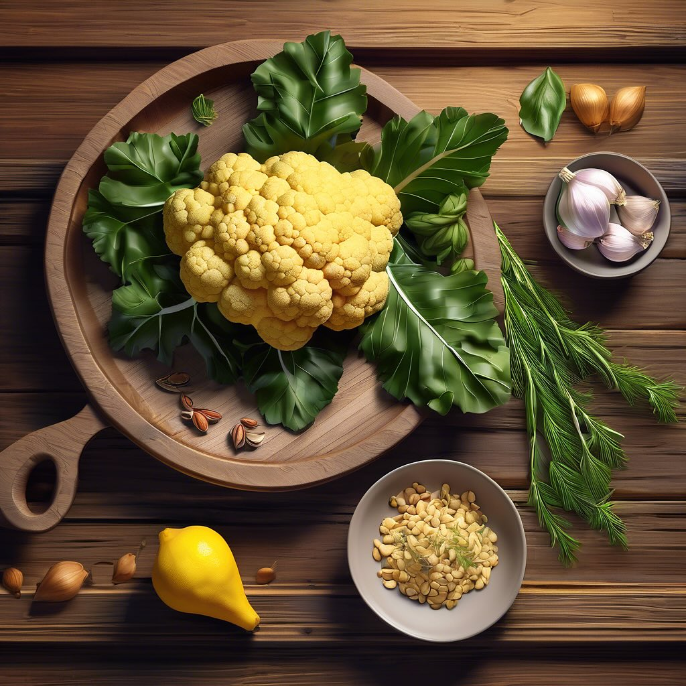

# 1

1. **Preparazione del cavolfiore**: Taglia il cavolfiore a cimette e lessalo in acqua salata fino a quando non è tenero. Scolalo e mettilo da parte. 2. **Salsa di aglio e pinoli**: In una padella, tosta i pinoli fino a doratura. Aggiungi dell’olio d’oliva e uno spicchio d’aglio tritato. Fai rosolare fino a quando l’aglio diventa dorato. 3. **Aggiunta di zafferano e limone**: Sciogli un pizzico di zafferano in un po’ di acqua calda e aggiungilo alla padella insieme al succo di limone e alla buccia grattugiata. 4. **Unione degli ingredienti**: Unisci il cavolfiore alla padella e mescola bene per far assorbire i sapori. 5. **Servizio**: aggiungere humus di ceci, guarnito con un po’ di prezzemolo fresco se lo desideri. 6. **humus**: Preparazione humus di ceci ### Ingredienti - 400 g di ceci in scatola (o 250 g di ceci secchi) - 2-3 cucchiai di tahin (pasta di sesamo) - 2-3 cucchiai di olio d’oliva - Succo di 1 limone - 1 spicchio d’aglio (opzionale) - Sale q.b. - Paprika o cumino (opzionali, per aromatizzare) - Acqua q.b. (per ottenere la consistenza desiderata) ### Procedimento 6.1. **Preparare i ceci**: Se usi ceci secchi, mettili in ammollo per almeno 8 ore e poi cuocili in acqua fino a renderli teneri. Se utilizzi ceci in scatola, scolali e risciacquali. 6.2. **Frullare gli ingredienti**: In un frullatore, unisci i ceci, il tahin, il succo di limone, l’olio d’oliva e l’aglio (se lo usi). Aggiungi un pizzico di sale. 6.3. **Aggiungere acqua**: Frulla il tutto, aggiungendo acqua poco alla volta fino a ottenere una consistenza cremosa e liscia. 6.4. **Aromatizzare**: Assaggia e regola di sale. Puoi anche aggiungere paprika o cumino per un sapore extra. 6.5. **Servire**: Trasferisci l’hummus in una ciotola, guarnisci con un filo d’olio d’oliva e una spolverata di paprika, se desideri.

---

*Ricetta da @leguminando*
