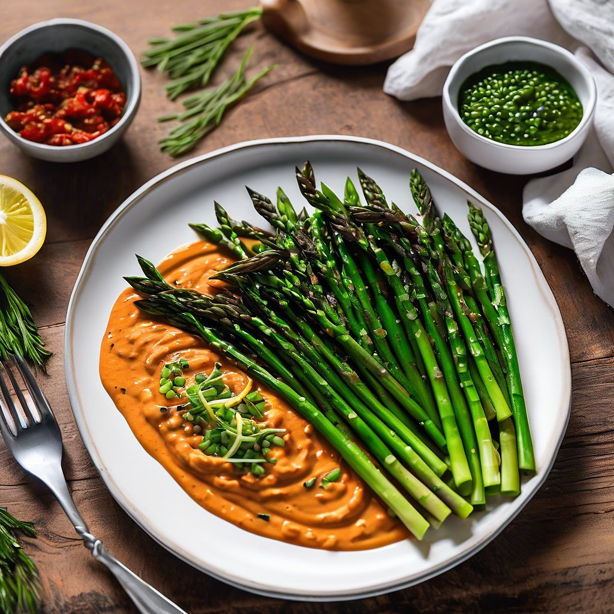

# ### Antipasto Misto con Baccelli, Prosciutto e Verdure Grigliate #### Ingredient

### Antipasto Misto con Baccelli, Prosciutto e Verdure Grigliate #### Ingredienti: - Baccelli freschi (broad beans) - Fette di prosciutto crudo - Pomodori secchi sott’olio - Capperi - Salsa di acciughe - Pane per bruschette - Olio extravergine d’oliva - Pomodorini ciliegia, tagliati a dadini - Peperoni gialli e rossi, grigliati - Zucchine, tagliate a fette sottili e grigliate #### Preparazione: 1. **Preparare i baccelli**: Lessare i baccelli in acqua salata per 3-4 minuti, quindi scolarli e raffreddarli sotto acqua corrente. Sgusciarli e tenerli da parte. 2. **Grigliare le verdure**: Affettare le zucchine e i peperoni. Grigliarli su una piastra calda fino a quando sono teneri e leggermente carbonizzati. Condire con un filo d’olio e sale. 3. **Preparare le bruschette**: Tostare il pane per bruschette su una griglia o in forno. Una volta dorato, spennellare con olio extravergine d’oliva. 4. **Assemblare**: Su un piatto da portata, disporre i baccelli, le fette di prosciutto, i pomodori secchi con capperi e la salsa di acciughe. Aggiungere le bruschette con pomodorini e le verdure grigliate. 5. **Servire**: Decorare con foglie di basilico fresco e servire subito.

---

*Ricetta da @leguminando*
