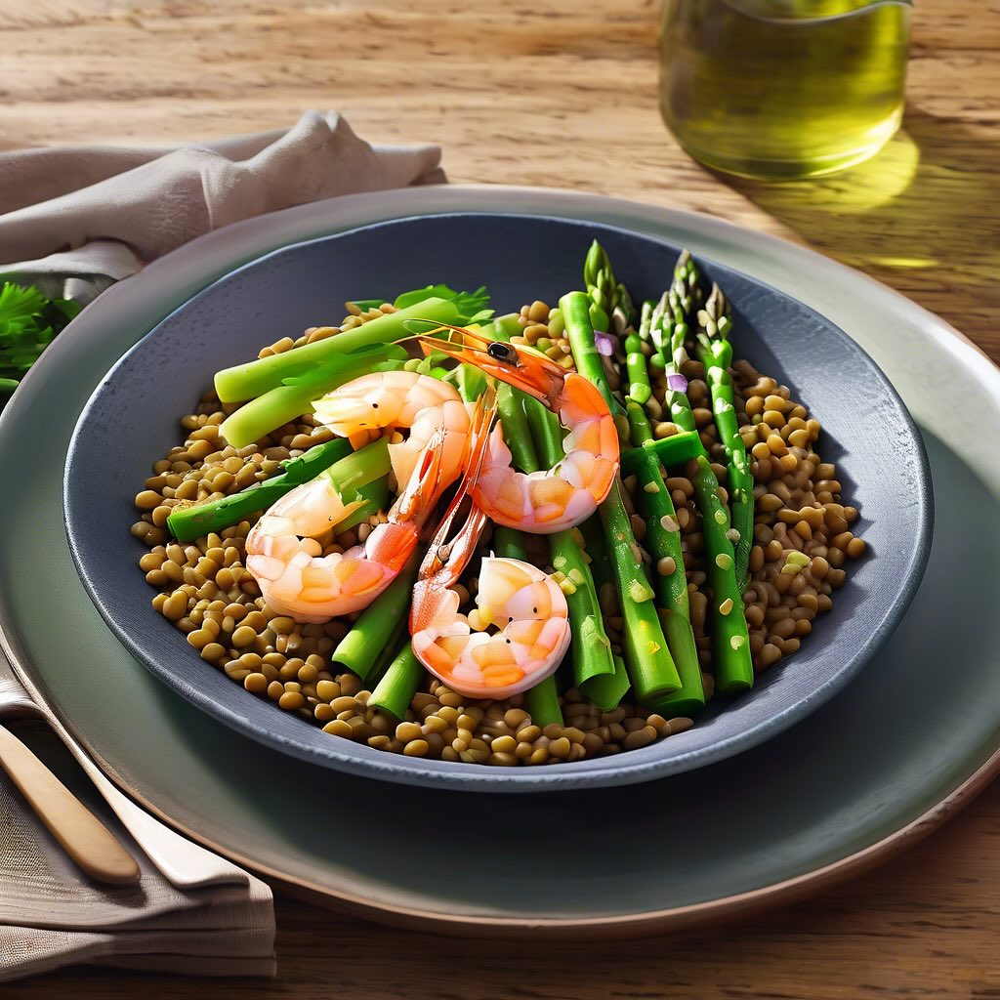

# ## Antipasto Misto di Asparagi, Baccelli e Piselli #### Ingredienti: - 200 g di 

## Antipasto Misto di Asparagi, Baccelli e Piselli #### Ingredienti: - 200 g di asparagi freschi - 150 g di baccelli (fagioli mangiatutto) - 150 g di piselli freschi (o surgelati, se non disponibili) - 100 g di formaggio feta sbriciolato - 50 g di mandorle tostate - Foglie di menta fresca - Succo di 1 limone - Olio extravergine d’oliva - Sale e pepe q.b. #### Preparazione: 1. **Preparare le verdure**: Lavare gli asparagi e i baccelli. Tagliare la parte legnosa degli asparagi e cuocerli in acqua bollente salata per 3-4 minuti, finché non sono teneri ma ancora croccanti. Scolare e raffreddare in acqua ghiacciata. 2. **Cuocere i piselli**: Se si utilizzano piselli freschi, lessarli in acqua bollente per 1-2 minuti. Scolare e raffreddare. Se si usano piselli surgelati, basta scongelarli. 3. **Assemblare il piatto**: In una ciotola grande, unire gli asparagi, i baccelli e i piselli. Aggiungere il formaggio feta sbriciolato e le mandorle tostate. 4. **Condire**: In una ciotolina, mescolare il succo di limone, l’olio d’oliva, sale e pepe. Versare il condimento sulle verdure e mescolare delicatamente per amalgamare il tutto. 5. **Servire**: Decorare con foglie di menta fresca e servire l’antipasto in un bel piatto, ideale per un picnic o una cena all’aperto.

---

*Ricetta da @leguminando*
