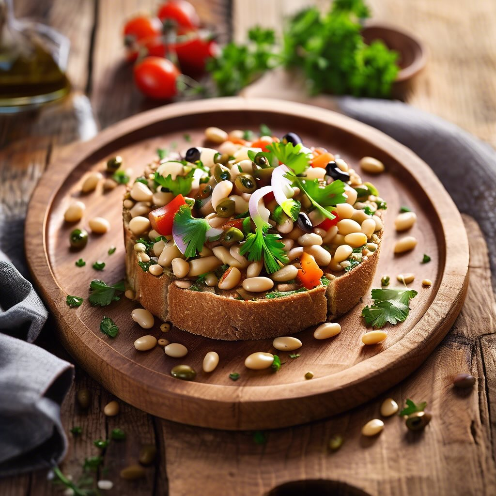

# ### Antipasto con Capperi, Acciughe, Fagioli dall’Occhio e Pane ai Cereali #### 

### Antipasto con Capperi, Acciughe, Fagioli dall’Occhio e Pane ai Cereali #### Ingredienti: - 200 g di fagioli dall’occhio (già lessati) - 100 g di acciughe sott’olio - 50 g di capperi dissalati - 4 fette di pane ai cereali - Olio extravergine d’oliva q.b. - Pepe nero macinato fresco - Prezzemolo fresco tritato (per guarnire) #### Preparazione: 1. **Preparazione dei fagioli:** Se non hai già i fagioli lessati, cuocili in acqua salata fino a quando sono teneri. Scolali e lasciali raffreddare. 2. **Composizione:** In una ciotola, unisci i fagioli lessati, le acciughe tagliate a pezzi e i capperi. Aggiungi un filo d’olio d’oliva e un pizzico di pepe nero. Mescola delicatamente per non rompere i fagioli. 3. **Preparazione del pane:** Tosta le fette di pane ai cereali su una griglia o in una padella fino a quando diventano dorate e croccanti. 4. **Impiattamento:** Distribuisci il composto di fagioli, acciughe e capperi su ogni fetta di pane tostato. Guarnisci con prezzemolo tritato per un tocco di freschezza. 5. **Servizio:** Servi subito il piatto, accompagnato da un ulteriore filo d’olio d’oliva se desiderato.

---

*Ricetta da @leguminando*
