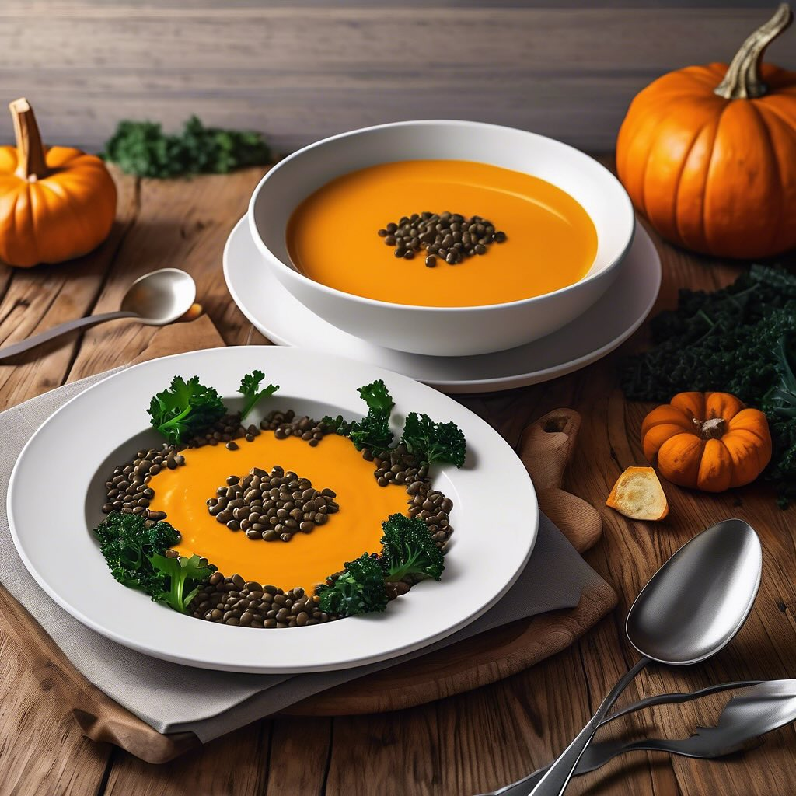

# ### Antipasto di Hummus con Gamberetti, Asparagi e Salmone Affumicato #### Ingre

### Antipasto di Hummus con Gamberetti, Asparagi e Salmone Affumicato #### Ingredienti: - **Per l’hummus:** - 400 g di ceci in scatola (sgocciolati) - 2 cucchiai di tahini - 1 spicchio d’aglio - Succo di 1 limone - 3 cucchiai di olio d’oliva - Sale e pepe q.b. - Acqua q.b. (per ottenere la consistenza desiderata) - **Per la guarnizione:** - 200 g di gamberetti freschi (sgusciati) - 200 g di asparagi - 100 g di salmone affumicato - Olio d’oliva - Limone (per servire) - Erbe fresche (prezzemolo o aneto) #### Preparazione: 1. **Preparare l’hummus:** In un mixer, unire i ceci, il tahini, l’aglio, il succo di limone e l’olio d’oliva. Frullare fino a ottenere una crema liscia. Se necessario, aggiungere acqua fino a raggiungere la consistenza desiderata. Aggiustare di sale e pepe. 2. **Cuocere gli asparagi:** Portare a ebollizione una pentola d’acqua salata. Aggiungere gli asparagi e scottarli per 2-3 minuti, finché non diventano teneri ma croccanti. Scolarli e immergerli in acqua fredda per fermare la cottura. 3. **Scottare i gamberetti:** In una padella, scaldare un filo d’olio d’oliva e aggiungere i gamberetti. Cuocere per 2-3 minuti, fino a quando diventano rosa e opachi. Aggiungere un pizzico di sale. 4. **Assemblare il piatto:** In un piatto da portata, stendere un generoso strato di hummus. Disporre i gamberetti scottati, gli asparagi e le fette di salmone affumicato sopra l’hummus. 5. **Guarnire:** Decorare con erbe fresche e fette di limone. Servire immediatamente.

---

*Ricetta da @leguminando*
