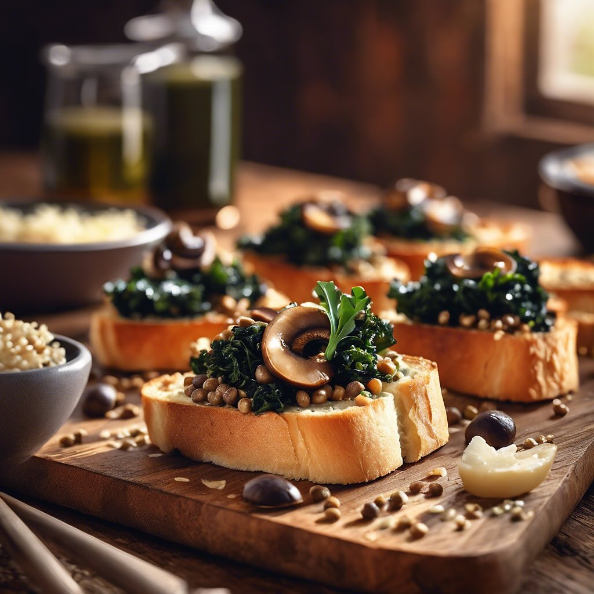

# ### Antipasto di Lenticchie e Funghi su Crostini di Pane Casalingo con Cavolo Ne

### Antipasto di Lenticchie e Funghi su Crostini di Pane Casalingo con Cavolo Nero #### Ingredienti: - 200 g di lenticchie (preferibilmente verdi o marroni) &#064;alcenerobiologico - 250 g di funghi (champignon o porcini), puliti e affettati &#064;slowfoodlivorno - 4 fette di pane casalingo - 200 g di cavolo nero, lavato e tagliato a strisce &#064;slowfoodtoscana - 2 spicchi d’aglio, tritati - 3 cucchiai di olio extravergine d’oliva. &#064;slowfood_costaetruschiaps - Sale e pepe q.b. - Peperoncino (facoltativo) - Parmigiano grattugiato (facoltativo) per guarnire #### Preparazione: 1. **Cottura delle Lenticchie**: In una pentola, porta a ebollizione dell’acqua salata e aggiungi le lenticchie. Cuoci per circa 20-25 minuti, fino a quando sono tenere. Scola e metti da parte. 2. **Cottura dei Funghi**: In una padella, scalda 2 cucchiai di olio d’oliva. Aggiungi l’aglio tritato e fai rosolare per un minuto. Aggiungi i funghi e cuoci fino a quando sono dorati e teneri. Aggiusta di sale, pepe e, se desideri, un pizzico di peperoncino. 3. **Cottura del Cavolo Nero**: Nella stessa padella, aggiungi il cavolo nero e un po’ d’acqua (circa 2 cucchiai). Copri e lascia cuocere per 5-7 minuti, finché il cavolo non si appassisce. Aggiungi un filo d’olio e mescola bene. 4. **Assemblaggio**: Preriscalda il forno a 200°C. Disponi le fette di pane su una teglia e spennellale con un po’ d’olio d’oliva. Tosta in forno per circa 5-7 minuti, fino a doratura. 5. **Composizione del Piatto**: Su ogni crostino di pane, distribuisci un po’ di lenticchie, seguito dai funghi e infine dal cavolo nero. Se desideri, spolvera con parmigiano grattugiato. 6. **Servizio**: Servi i crostini caldi o a temperatura ambiente come antipasto.

---

*Ricetta da @leguminando*
