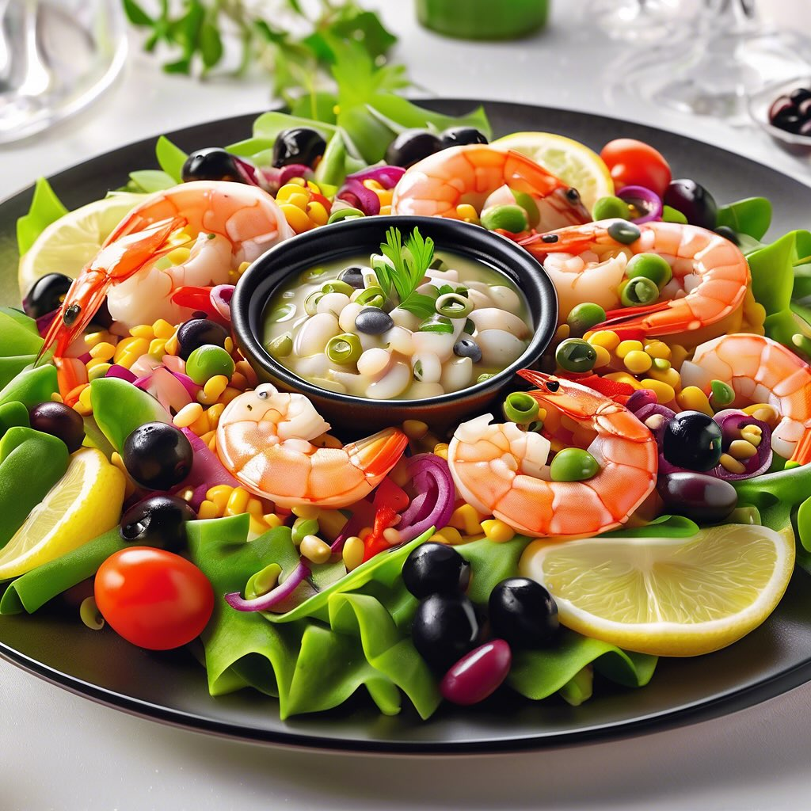

# ## Antipasto di Mare con Legumi, Capperi e Olive #### Ingredienti: - 200 g di ga

## Antipasto di Mare con Legumi, Capperi e Olive #### Ingredienti: - 200 g di gamberi sgusciati - 200 g di calamari puliti e tagliati ad anelli - 150 g di fagioli cannellini lessati - 150 g di ceci lessati - 50 g di capperi dissalati - 100 g di olive nere denocciolate - 1 spicchio d’aglio - Succo di 1 limone - Olio extravergine d’oliva q.b. - Sale e pepe q.b. - Prezzemolo fresco tritato per guarnire #### Preparazione: 1. **Cottura dei frutti di mare**: In una padella, scaldate un filo d’olio extravergine d’oliva e fate rosolare lo spicchio d’aglio schiacciato. Aggiungete i gamberi e i calamari, cuocendo per circa 3-4 minuti fino a quando i gamberi diventano rosa e i calamari sono teneri. Rimuovete dall fuoco e lasciate raffreddare. 2. **Preparazione dei legumi**: In una ciotola grande, unite i fagioli cannellini, i ceci, i capperi e le olive nere. Aggiungete il succo di limone, un filo d’olio d’oliva, sale e pepe a piacere. Mescolate bene per amalgamare i sapori. 3. **Assemblaggio**: Unite i frutti di mare raffreddati alla ciotola con i legumi e mescolate delicatamente per non rompere i gamberi e i calamari. Lasciate riposare in frigorifero per almeno 30 minuti per far insaporire il piatto. 4. **Servizio**: Prima di servire, guarnite con prezzemolo fresco tritato e un ulteriore filo d’olio d’oliva. Potete presentare l’antipasto in coppette o su un piatto grande da portata.

---

*Ricetta da @leguminando*
