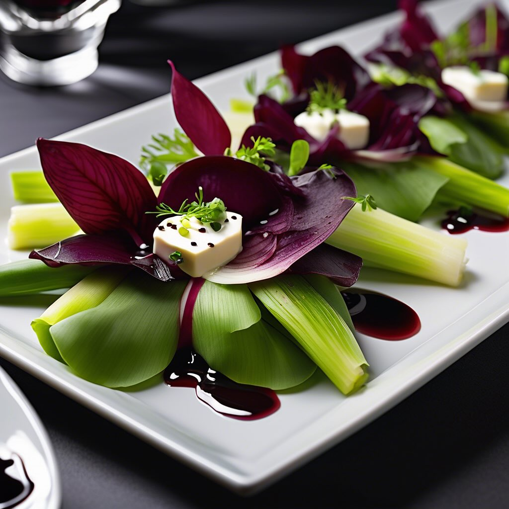

# ### Antipasto di Porri, Fave e Radicchio Rosso #### Ingredienti: - 2 porri - 200

### Antipasto di Porri, Fave e Radicchio Rosso #### Ingredienti: - 2 porri - 200 g di fave fresche o surgelate - 1 cespo di radicchio rosso - 50 g di formaggio di capra (opzionale) - Olio extravergine d’oliva - Aceto balsamico - Sale e pepe q.b. - Erbe fresche (come menta o basilico) per decorare #### Istruzioni: 1. **Preparazione delle fave**: Se usi fave fresche, sbollentale in acqua salata per circa 2-3 minuti, poi scolale e raffreddale in acqua ghiacciata. Se usi fave surgelate, scongelale e mettile da parte. 2. **Cottura dei porri**: Pulisci i porri e affettali a rondelle. Scalda un po’ d’olio in una padella e aggiungi i porri. Cuoci a fuoco medio per circa 5-7 minuti, finché non diventano teneri. 3. **Preparazione del radicchio**: Lava il radicchio e taglialo a strisce. Puoi anche grigliarlo brevemente per un sapore affumicato. 4. **Assemblaggio del piatto**: In un piatto, disponi i porri cotti, le fave e il radicchio. Se desideri, aggiungi dei pezzetti di formaggio di capra sopra. 5. **Condimento**: Drizza un po’ di aceto balsamico e un filo d’olio extravergine d’oliva. Aggiusta di sale e pepe. 6. **Decorazione**: Guarnisci con erbe fresche per un tocco finale.

---

*Ricetta da @leguminando*
