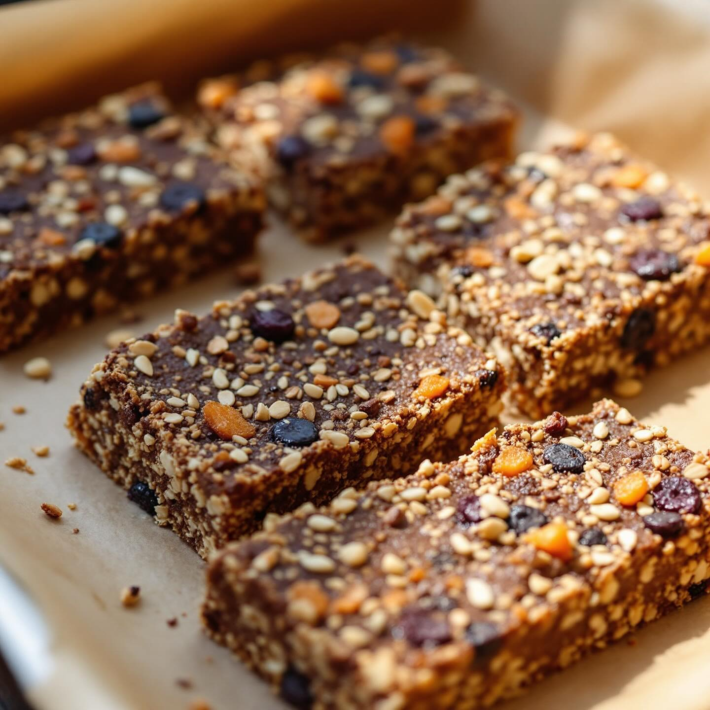

# Barrette croccanti quinoa, carrube &amp; cacao Dose: 12 barrette (stampo 20×20 c

Barrette croccanti quinoa, carrube &amp; cacao Dose: 12 barrette (stampo 20×20 cm) Ingredienti - 80 g quinoa integrale (cruda) - 150 ml acqua - 30 g farina di carrube - 20 g cacao amaro in polvere - 100 g yogurt magro - 2 cucchiai (≈30 ml) olio extravergine d’oliva - 2 cucchiai (≈30 g) miele o sciroppo d’agave - 50 g frutta secca disidratata a pezzi (es. albicocche o mirtilli) - 30 g pinoli - 30 g pistacchi tritati - Un pizzico di sale Preparazione 1. Sciacqua la quinoa sotto acqua corrente finché l’acqua è limpida. Mettila in un pentolino con 150 ml d’acqua, porta a bollore, copri e cuoci a fuoco basso 12–15 minuti fino ad assorbimento. Spegni, lascia riposare 5 minuti e sgrana con una forchetta; fai raffreddare completamente. 2. Preriscalda il forno a 170 °C (statico). Fodera uno stampo 20×20 cm con carta da forno. 3. In una ciotola unisci yogurt, olio e miele; mescola fino a ottenere una crema omogenea. Aggiungi la quinoa raffreddata. 4. Setaccia farina di carrube e cacao direttamente sul composto umido; aggiungi il sale e mescola giusto il tempo di amalgamare. 5. Unisci la frutta secca disidratata a pezzi, i pinoli e i pistacchi (tenerne una manciata da parte per guarnire). Mescola delicatamente. 6. Versa il composto nello stampo e premi energicamente con il dorso di un cucchiaio o con le dita (aiutati con carta forno) per compattare bene e ottenere una superficie liscia; distribuisci i pinoli/pistacchi rimasti sopra. 7. Cuoci in forno 22–28 minuti: la superficie deve risultare ben fissata e leggermente croccante. Lascia raffreddare completamente nello stampo (meglio 1–2 ore) per far solidificare le barrette. 8. Sforma e taglia in 12 barrette regolari. Conservazione: in frigorifero fino a 4 giorni, o a temperatura ambiente in scatola ermetica per 2–3 giorni.

---

*Ricetta da @leguminando*
