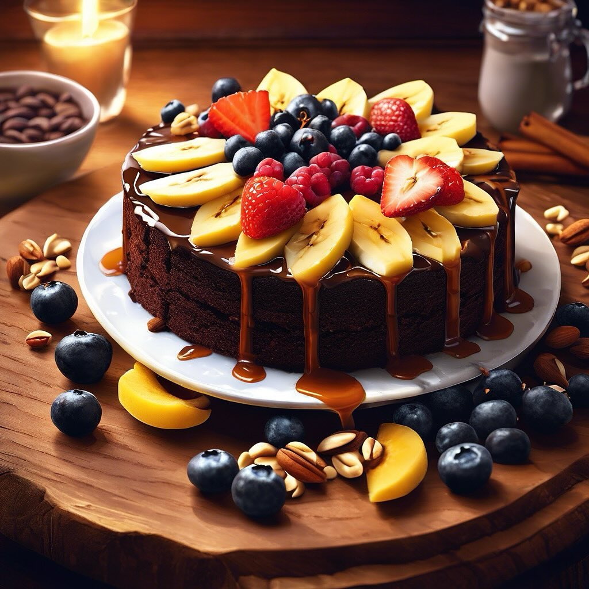

# ### Bowl di Yogurt Greco con Frutta Secca e Farina di Carrube #### Ingredienti: 

### Bowl di Yogurt Greco con Frutta Secca e Farina di Carrube #### Ingredienti: - 200 g di yogurt greco - 30 g di pinoli - 30 g di anacardi - 30 g di pistacchi - 2 cucchiai di miele - 1-2 cucchiai di farina di carrube - Frutta fresca a piacere (ad esempio banane, fragole o mirtilli) #### Istruzioni: 1. **Preparazione della base**: In una ciotola, versa lo yogurt greco e livellalo con il dorso di un cucchiaio. 2. **Aggiunta della farina di carrube**: Spolvera la farina di carrube sopra lo yogurt. Puoi mescolare per amalgamare i due ingredienti o lasciarla in superficie per un effetto visivo. 3. **Tostatura della frutta secca**: In una padella antiaderente, tosta leggermente i pinoli, gli anacardi e i pistacchi a fuoco medio per 2-3 minuti, mescolando frequentemente, fino a quando non saranno dorati e profumati. Questo passaggio è facoltativo, ma esalta i sapori. 4. **Assemblaggio**: Distribuisci la frutta secca tostata sopra lo yogurt. Aggiungi anche la frutta fresca che hai scelto. 5. **Guarnizione con miele**: Infine, versa il miele sopra il tutto. Puoi regolare la quantità di miele in base al tuo gusto personale. 6. **Servire**: Gustalo subito per una colazione ricca di nutrienti e sapori!

---

*Ricetta da @leguminando*
