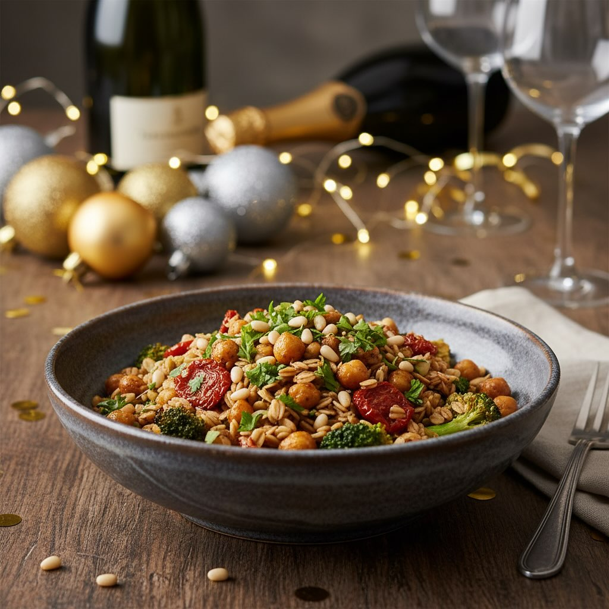

# Buon San Silvestro!!!! 2025…

Buon San Silvestro!!!! 2025…. 👋🏻👋🏻 Lasciamo questo 2025 con un antipasto facile, veloce e gustoso… ### Ingredienti - 100 g di avena decorticata - 250 g di ceci cotti - 1 broccolo/cavolfiore - 8-10 pomodori secchi sott’olio - 1 limone (succo e scorza) - Peperoncino a piacere - 2 spicchi di aglio - 2 cucchiai di curcuma - Olio extravergine di oliva - Sale e pepe q.b. ## Preparazione 1. **Cuocere l&#039;’vena**: Sciacqua l&#039;’vena sotto acqua corrente. Cuocila in abbondante acqua salata per circa 25-30 minuti, o fino a che non diventa tenera. Scolala e lasciala raffreddare. 2. **Preparare i broccoli**: Lava i broccoli e tagliali a piccoli pezzi. Cuocili a vapore o in acqua bollente per 4-5 minuti, finché non diventano teneri ma ancora croccanti. Scolali e immergili in acqua fredda per mantenere il colore verde brillante. 3. **Soffriggere l&#039;’glio**: In una padella, scalda un filo d&#039;’lio extravergine di oliva. Aggiungi gli spicchi d&#039;’glio tritati e il peperoncino, facendo attenzione a non bruciarli. 4. **Unire gli ingredienti**: In una grande ciotola, mescola l&#039;’vena cotta, i ceci, i broccoli, e i pomodori secchi tagliati a pezzetti. Aggiungi l&#039;’glio soffritto con l’olio e il peperoncino. 5. **Condire**: Aggiungi la curcuma, il succo e la scorza di limone. Condisci con sale e pepe a piacere. Mescola bene per amalgamare tutti i sapori.

---

*Ricetta da @leguminando*
