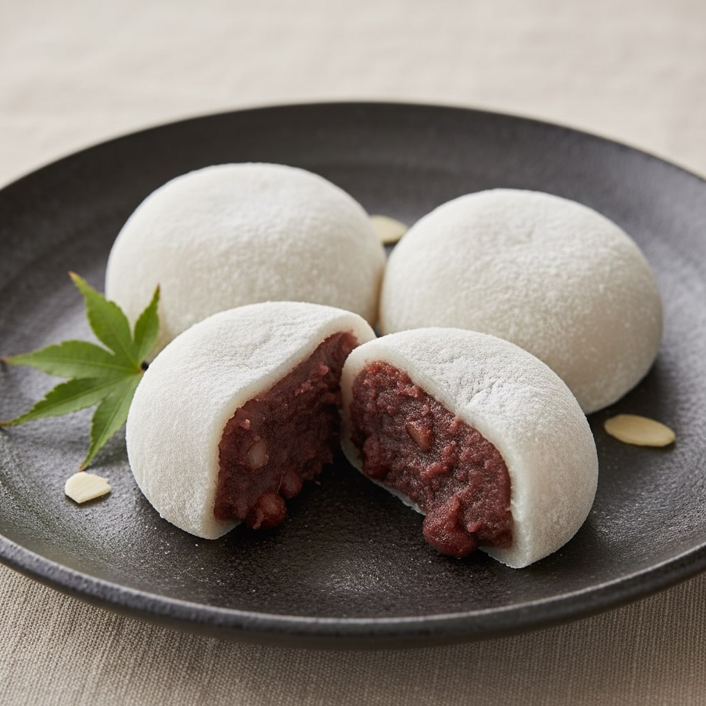

# | Categoria | Quantità (per ≈ 8‑10 palline) | |————|——————————| | **Per la pasta

| Categoria | Quantità (per ≈ 8‑10 palline) | |————|——————————| | **Per la pasta di mochi** | | | Mochiko (farina di riso glutinoso giapponese) | 250 g | | Zucchero semolato | 30 g | | Acqua | 260 ml | | Sciroppo d’orzo *mizuame* (opz.) o miele chiaro | 1 cucchiaio | | **Per il ripieno di fagioli rossi** | | | Fagioli azuki Rossi (sukoi) sgusciati e lessati | 300 g | | Zucchero semolato | 70‑90 g (a seconda del livello di dolcezza desiderato) | | Sale fino | un pizzichino | | Acqua | 150 ml (per la cottura dei fagioli) | | **Per la lavorazione** | | | Amido di patate (o fecola di mais) | q.b. per spolverare le mani e il piano di lavoro | | Noci tostate o semi di sesamo (opz.) | qualche decina di chicchi, per decorare | Crema di fagioli rossi (anko) - Cuoci gli azuki in acqua per 45–60 min finché teneri ma non sfatti; scola. - Schiaccia leggermente i fagioli mantenendo alcuni granuli. - Cuoci con lo zucchero 10 min mescolando fino a ottenere una crema densa ma non appiccicosa; aggiungi sale, cuoci 2 min e fai raffreddare. - (Opz.) Per un anko più morbido aggiungi 30 ml di sciroppo d’orzo o miele prima del raffreddamento. - Forma palline da 15–20 g quando l’impasto è maneggevole. Pasta di mochi - Setaccia mochiko e zucchero, aggiungi acqua e sciroppo/miele fino a ottenere un impasto liscio, denso ma fluido. - Cuoci a vapore in uno stampo coperto 10–12 min (oppure al microonde a intervalli mescolando) finché diventa trasparente e lucido. - Raffredda 2–3 min fino a tiepido. Spolvera piano di lavoro e mani con amido di patate/fecola. Assemblaggio - Schiaccia una pallina di anko in un disco (≈10 cm × 5 mm) e mettila al centro del disco di mochi; richiudi sigillando e arrotonda. - Elimina l’eccesso di amido e continua fino a esaurire ingredienti. - (Opz.) Decora facendo un piccolo “fiore” con un bastoncino o aggiungendo chicchi/noci tostate.

---

*Ricetta da @leguminando*
