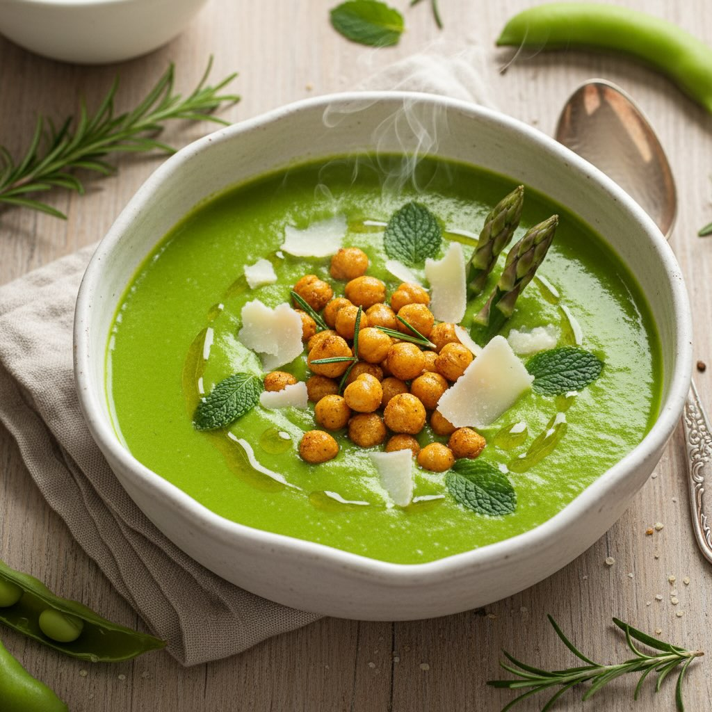

# Crema Neon di Fave e Asparagi con Ceci Croccanti al Rosmarino 💚 ⏱ Tempo: 25 minu

Crema Neon di Fave e Asparagi con Ceci Croccanti al Rosmarino 💚 ⏱ Tempo: 25 minuti 👨‍🍳 Difficoltà: Facile 🍽 Porzioni: 2 persone ### Ingredienti - 300g fave fresche (sgranate, già spellate se possibile) o 400g surgelate - 200g asparagi freschi - 1 patata media (per cremosità) - 200g ceci precotti (o 100g secchi, cotti) - 1 scalogno - Rosmarino fresco - Pecorino romano a scaglie - Olio evo - Sale, pepe #leguminando Questo verde ti ferma lo scroll. Crema di fave e asparagi, ceci croccanti al rosmarino, pecorino a scaglie. Comfort food che urla primavera. La ricetta completa nel primo commento, salvatela per la prossima cena che vuoi fare figura senza sudare troppo. Metti like se ti è venuta fame 👇🫘

---

*Ricetta da @leguminando*
