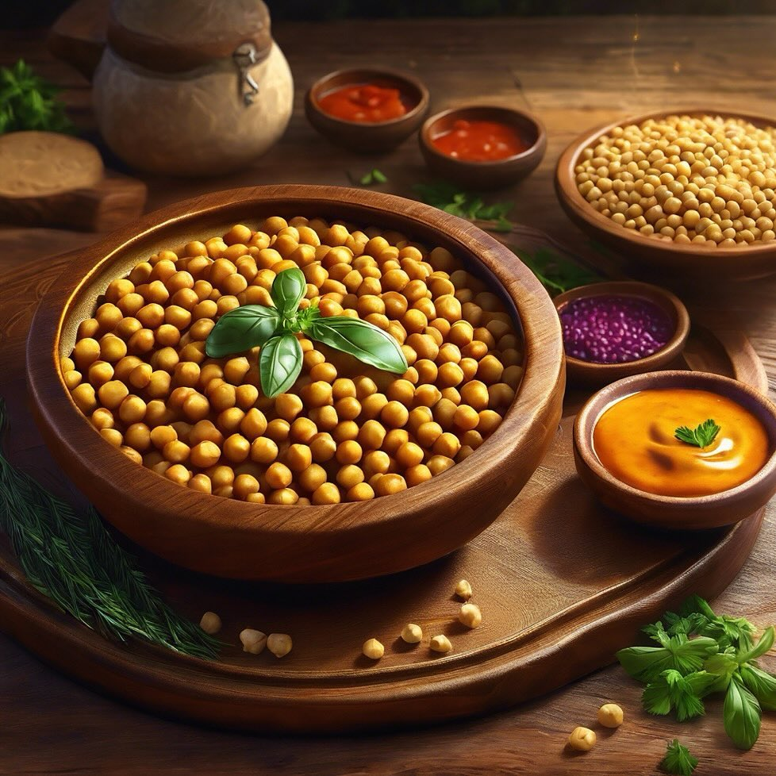

# Curry di Ceci e Lenticchie **Ingredienti**: - 200 g di ceci - 200 g di lenticchi

Curry di Ceci e Lenticchie **Ingredienti**: - 200 g di ceci - 200 g di lenticchie - 1 cipolla - 2 spicchi d’aglio - 1 pezzo di zenzero - 400 ml di latte di cocco - 2 cucchiaini di curry in polvere - 1 cucchiaino di curcuma - Sale q.b. **Preparazione**: 1. Soffriggi la cipolla, l’aglio e lo zenzero tritati in olio d’oliva. 2. Aggiungi il curry e la curcuma, mescolando per 1 minuto. 3. Unisci i ceci e le lenticchie, poi versa il latte di cocco. 4. Cuoci a fuoco lento per 20-25 minuti, fino a quando le lenticchie sono tenere. 5. Aggiusta di sale e servi con riso. - **Varianti**: Puoi aggiungere verdure come spinaci o patate dolci per aumentare il volume e il sapore. - **Consiglio**: Servi il curry con riso basmati o naan per un pasto completo.

---

*Ricetta da @leguminando*
