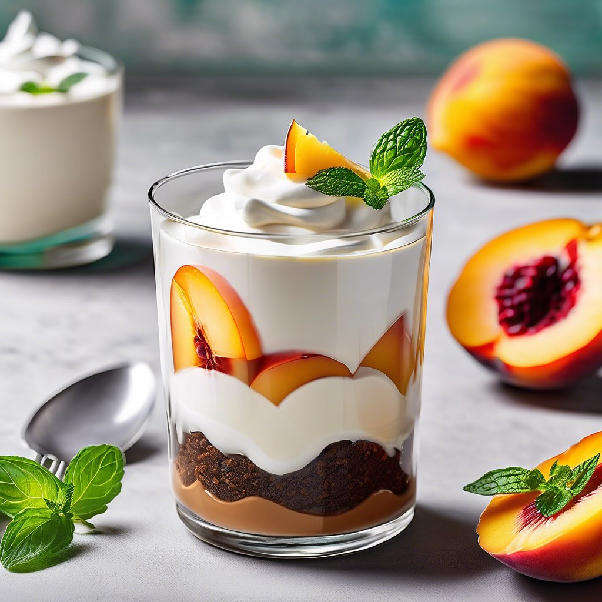

# ### Dessert di Pesche e Yogurt Greco con Farina di Carrube #### Ingredienti: - *

### Dessert di Pesche e Yogurt Greco con Farina di Carrube #### Ingredienti: - **Per il dessert**: - 3 pesche mature - 250 g di yogurt greco - 2 cucchiai di miele (o sciroppo d’agave) - Succo di 1 limone - Scorza di 1 limone - 3 cucchiai di farina di carrube - Un pizzico di sale - **Per la decorazione**: - Fette di pesca - Foglie di menta fresca - Un cucchiaio di farina di carrube in polvere #### Preparazione: 1. **Preparazione delle pesche**: - Lavare e affettare le pesche. Se preferisci, puoi sbucciarle. Mettere da parte alcune fette per la decorazione. - In una ciotola, mescolare le fette di pesca con il succo di limone e un cucchiaio di miele. Lasciare marinare per circa 15 minuti. 2. **Preparazione della crema di yogurt**: - In una ciotola, unire lo yogurt greco, il miele rimanente, la scorza di limone, la farina di carrube e un pizzico di sale. Mescolare bene fino a ottenere una crema omogenea. 3. **Assemblaggio del dessert**: - In bicchierini o coppette, alternare uno strato di crema di yogurt con uno strato di pesche marinate. - Continuare con un altro strato di yogurt e completare con le pesche. 4. **Decorazione**: - Guarnire con fette di pesca fresche, una spolverata di farina di carrube e alcune foglie di menta fresca. 5. **Servire**: - Refrigerare per circa 30 minuti prima di servire per far amalgamare i sapori. Servire freddo e gustare questo dessert fresco e fruttato!

---

*Ricetta da @leguminando*
