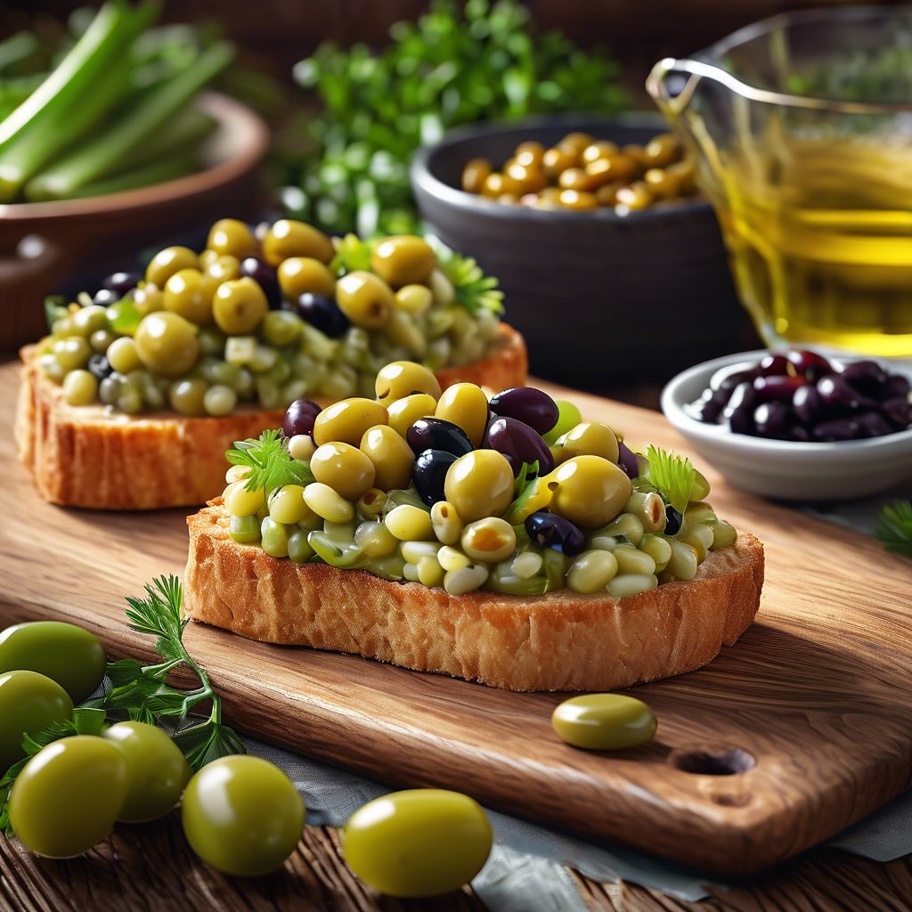

# Ecco la ricetta per i Crostini con Fagioli e Relish di Sedano e Olive: ### Ingre

Ecco la ricetta per i Crostini con Fagioli e Relish di Sedano e Olive: ### Ingredienti: - Fette di pane croccante (crostini) - 1 tazza di fagioli (preferibilmente fagioli bianchi o borlotti, lessati) - 1/2 tazza di sedano, tritato finemente - 1/4 di tazza di olive verdi o nere, denocciolate e tritate - 2 cucchiai di olio d’oliva - 1 spicchio d’aglio, tritato - Sale e pepe q.b. - Erbe fresche per guarnire (prezzemolo o basilico) ### Istruzioni: 1. In una ciotola, unisci i fagioli lessati, il sedano tritato e le olive. Aggiungi l’olio d’oliva e l’aglio tritato. 2. Mescola bene e aggiusta di sale e pepe a piacere. 3. Tosta i crostini in un forno preriscaldato a 200°C fino a doratura. 4. Una volta pronti, distribuisci generosamente il mix di fagioli, sedano e olive sui crostini. 5. Guarnisci con erbe fresche e un filo d’olio d’oliva.

---

*Ricetta da @leguminando*
