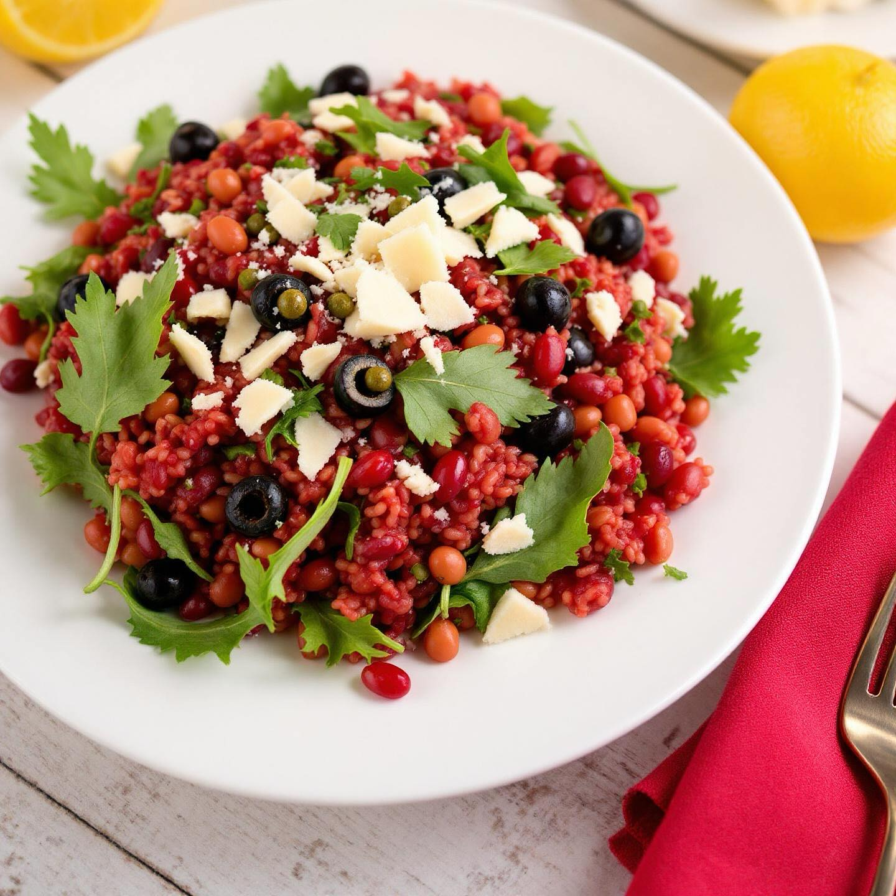

# Ecco la ricetta per un gustoso primo piatto a base di riso rosso, olive, capperi

Ecco la ricetta per un gustoso primo piatto a base di riso rosso, olive, capperi, rucola, fagioli rossi e scaglie di parmigiano. ### Ingredienti - 200 g di riso rosso - 100 g di olive nere denocciolate - 2 cucchiai di capperi - Un mazzetto di rucola - 150 g di fagioli rossi (già cotti) - Scaglie di parmigiano q.b. - Olio extravergine d’oliva - Sale e pepe q.b. ### Preparazione 1. **Cottura del riso**: In una pentola, cuocere il riso rosso in abbondante acqua salata seguendo le istruzioni riportate sulla confezione (di solito per circa 20-25 minuti). Una volta cotto, scolarlo e lasciarlo raffreddare. 2. **Preparare gli ingredienti**: Mentre il riso cuoce, tagliare le olive a rondelle e sciacquare i capperi per eliminare il sale in eccesso. Lavare e asciugare la rucola. 3. **Assemblare il piatto**: In una ciotola capiente, unire il riso rosso raffreddato, le olive, i capperi, i fagioli rossi e la rucola. Mescolare delicatamente per amalgamare gli ingredienti. 4. **Condimento**: Aggiungere un filo di olio extravergine d’oliva, sale e pepe a piacere. Mescolare nuovamente per distribuire il condimento. 5. **Servire**: Impiattare il riso e guarnire con scaglie di parmigiano. Servire il piatto freddo o a temperatura ambiente.

---

*Ricetta da @leguminando*
