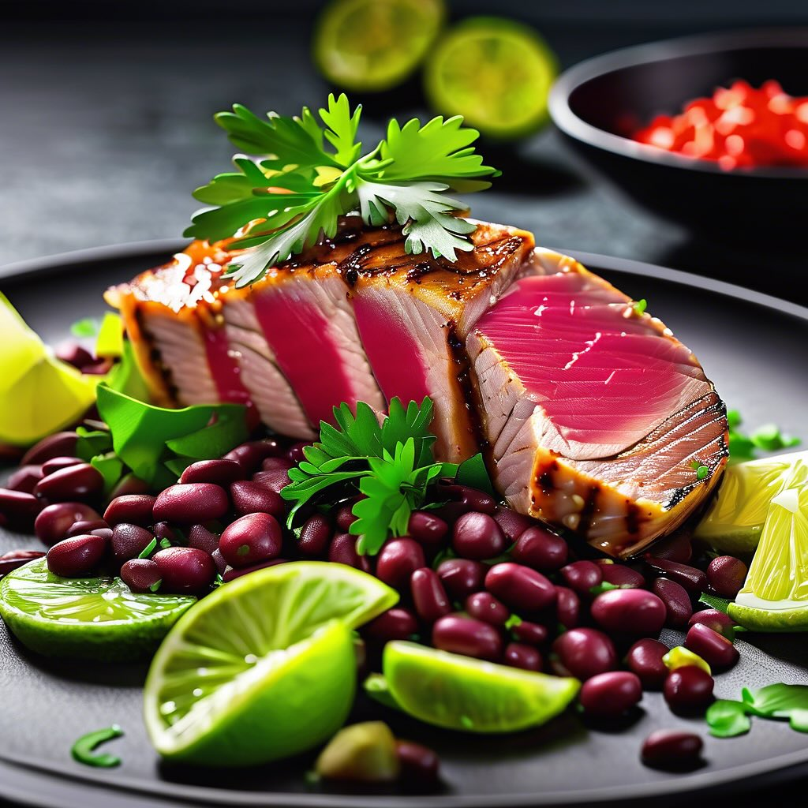

# Ecco una deliziosa ricetta per filetti di tonno alla griglia con fagioli e lime

Ecco una deliziosa ricetta per filetti di tonno alla griglia con fagioli e lime. ### Ingredienti: - 2 filetti di tonno fresco - 1 tazza di fagioli misti (fagioli neri, verdi, rossi) - 1 lime (succo e fette) - 2 cucchiai di olio d’oliva - 2 spicchi d’aglio, tritati - Sale e pepe q.b. - Erbe fresche (come coriandolo o prezzemolo) per guarnire ### Preparazione: 1. **Marinatura del Tonno:** - In una ciotola, mescola l’olio d’oliva, il succo di lime, l’aglio tritato, il sale e il pepe. - Aggiungi i filetti di tonno e lasciali marinare in frigorifero per almeno 30 minuti. 2. **Preparazione dei Fagioli:** - Se utilizzi fagioli in scatola, sciacquali sotto acqua corrente. Se utilizzi fagioli secchi, cuocili in acqua salata fino a renderli teneri. - Scolali e condiscili con un po’ d’olio, succo di lime, sale e pepe. 3. **Cottura del Tonno:** - Riscalda una griglia o una padella antiaderente a fuoco medio-alto. - Cuoci i filetti di tonno per circa 2-3 minuti per lato, o fino a raggiungere il grado di cottura desiderato. Il tonno dovrebbe rimanere rosa al centro. 4. **Impiattamento:** - Disponi i filetti di tonno su un piatto da portata. Aggiungi i fagioli accanto al tonno e guarnisci con fette di lime.

---

*Ricetta da @leguminando*
