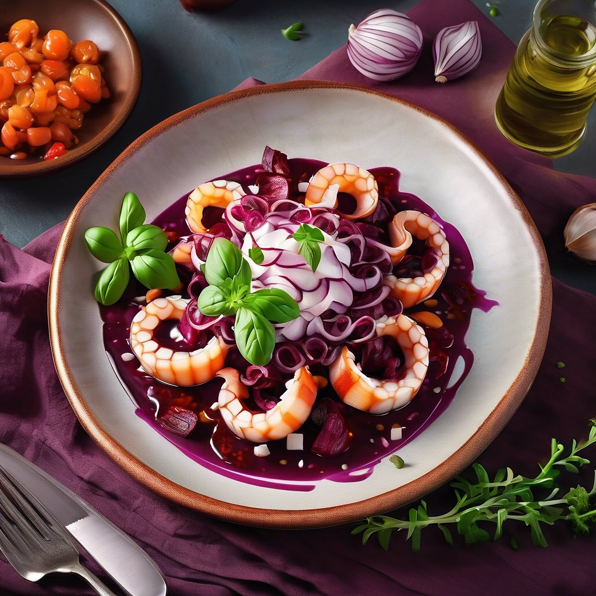

# Ecco una ricetta per un antipasto delizioso a base di polpo, radicchio rosso, ag

Ecco una ricetta per un antipasto delizioso a base di polpo, radicchio rosso, aglio e fagioli borlotti. ### Ingredienti: - 300 g di polpo - 150 g di radicchio rosso - 200 g di fagioli borlotti (cotti e scolati) - 2 spicchi d’aglio - Olio extravergine d’oliva - Sale e pepe q.b. - Prezzemolo fresco per guarnire - Succo di limone (opzionale) ### Preparazione: 1. **Cottura del Polpo**: In una pentola capiente, porta a ebollizione dell’acqua salata. Aggiungi il polpo e cuocilo per circa 40-50 minuti, fino a quando non risulta tenero. Una volta cotto, scolalo e lascialo raffreddare. Quando è freddo, taglialo a pezzi. 2. **Preparazione del Radicchio**: Lava il radicchio e taglialo a strisce. In una padella, scalda un filo d’olio e aggiungi gli spicchi d’aglio schiacciati. Quando l’aglio è dorato, aggiungi il radicchio e cuoci per circa 5-7 minuti, fino a quando non è appassito. Aggiusta di sale e pepe. 3. **Unione degli Ingredienti**: In una ciotola grande, unisci il polpo cotto, il radicchio ripassato e i fagioli borlotti. Mescola delicatamente per amalgamare i sapori. Se desideri, puoi aggiungere un po’ di succo di limone per un tocco di freschezza. 4. **Impiattamento**: Disponi il composto su un piatto da portata. Guarnisci con prezzemolo fresco tritato e un filo d’olio d’oliva. 5. **Servire**: Servi l’antipasto a temperatura ambiente o leggermente tiepido.

---

*Ricetta da @leguminando*
