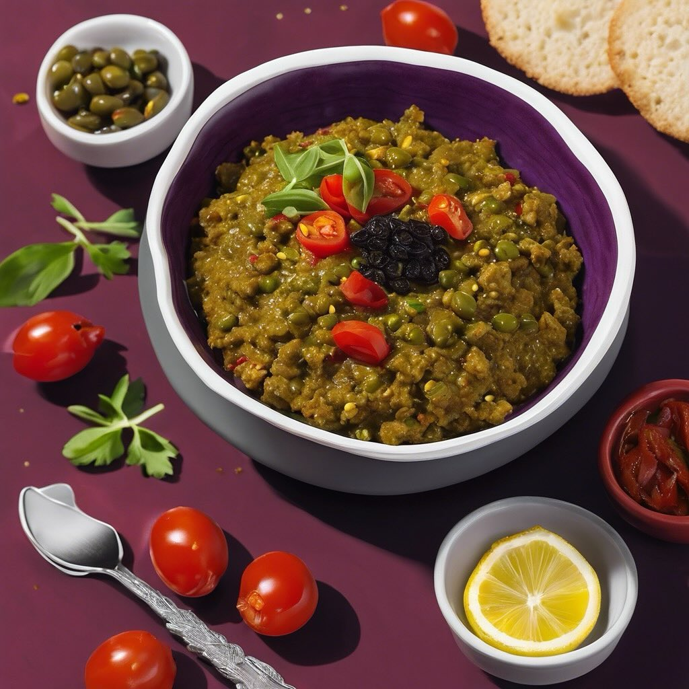

# Ecco una ricetta semplice per preparare una deliziosa crema da accompagnare ai f

Ecco una ricetta semplice per preparare una deliziosa crema da accompagnare ai falafel. ### Crema di Olive Taggiasche e Capperi #### Ingredienti: - 100 g di olive taggiasche denocciolate - 2 cucchiai di capperi - 3-4 pomodori secchi - 2-3 filetti di alici sott’olio - Succo di 1 limone - 4-5 cucchiai di olio d’oliva extravergine (per consigli &#064;slowfoodtoscana &#064;slowfoodlivorno ) - Pepe nero (opzionale) #### Procedimento: 1. **Preparazione degli ingredienti**: Se i pomodori secchi non sono già morbidi, mettili in ammollo in acqua calda per circa 10-15 minuti per reidratarli. 2. **Frullare**: In un mixer, unisci le olive taggiasche, i capperi, i pomodori secchi, le alici e il succo di limone. Frulla fino a ottenere un composto omogeneo. 3. **Aggiungere l’olio**: Mentre frulli, aggiungi l’olio d’oliva a filo, fino a raggiungere la consistenza desiderata. Puoi regolare la quantità di olio in base alla cremosità che preferisci. 4. **Condire**: Assaggia e aggiusta di sale e pepe, se necessario. Tieni presente che le olive e i capperi sono già salati. 5. **Servire**: Trasferisci la crema in una ciotola e servila con i falafel, accompagnata da pita o verdure fresche. Questa crema avrà un sapore ricco e saporito, perfetto per esaltare i falafel! Buon appetito!

---

*Ricetta da @leguminando*
