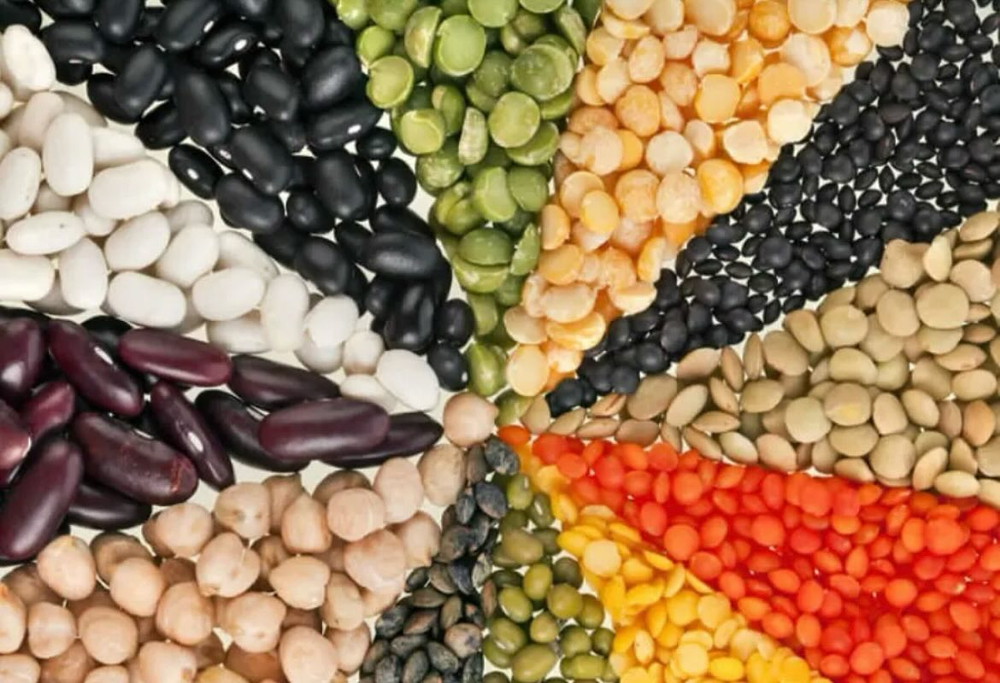

# Hummus Classico **Ingredienti:** - 400g di ceci lessati - 2 cucchiai di tahin - 

Hummus Classico **Ingredienti:** - 400g di ceci lessati - 2 cucchiai di tahin - 2 cucchiai di olio d’oliva - Succo di 1 limone - 1 spicchio d’aglio - Sale q.b. - Paprika per guarnire **Preparazione:** 1. **Preparazione dei ceci:** Se utilizzi ceci secchi, inizia mettendoli in ammollo per una notte. Questo aiuta a ridurre i tempi di cottura e migliora la digeribilità. Il giorno successivo, scolali e lessali in acqua salata fino a quando diventano teneri. 2. **Frullatura degli ingredienti:** In un frullatore, aggiungi i ceci lessati, il tahin, l’olio d’oliva, il succo di limone, l’aglio e un pizzico di sale. Frulla il tutto fino a ottenere una consistenza liscia e cremosa. Se il composto risulta troppo denso, puoi aggiungere un po’ d’acqua per raggiungere la consistenza desiderata. 3. **Assaggio e aggiustamenti:** A questo punto, assaggia l’hummus e aggiusta di sale o succo di limone secondo il tuo gusto. Ricorda che il sapore migliora se lasci riposare l’hummus in frigorifero per almeno 30 minuti prima di servirlo. 4. **Presentazione:** Trasferisci l’hummus in una ciotola e crea un vortice al centro con il dorso di un cucchiaio. Aggiungi un filo d’olio d’oliva e spolvera con paprika per un tocco di colore. Servi con pita calda o verdure fresche tagliate a bastoncini.

---

*Ricetta da @leguminando*
