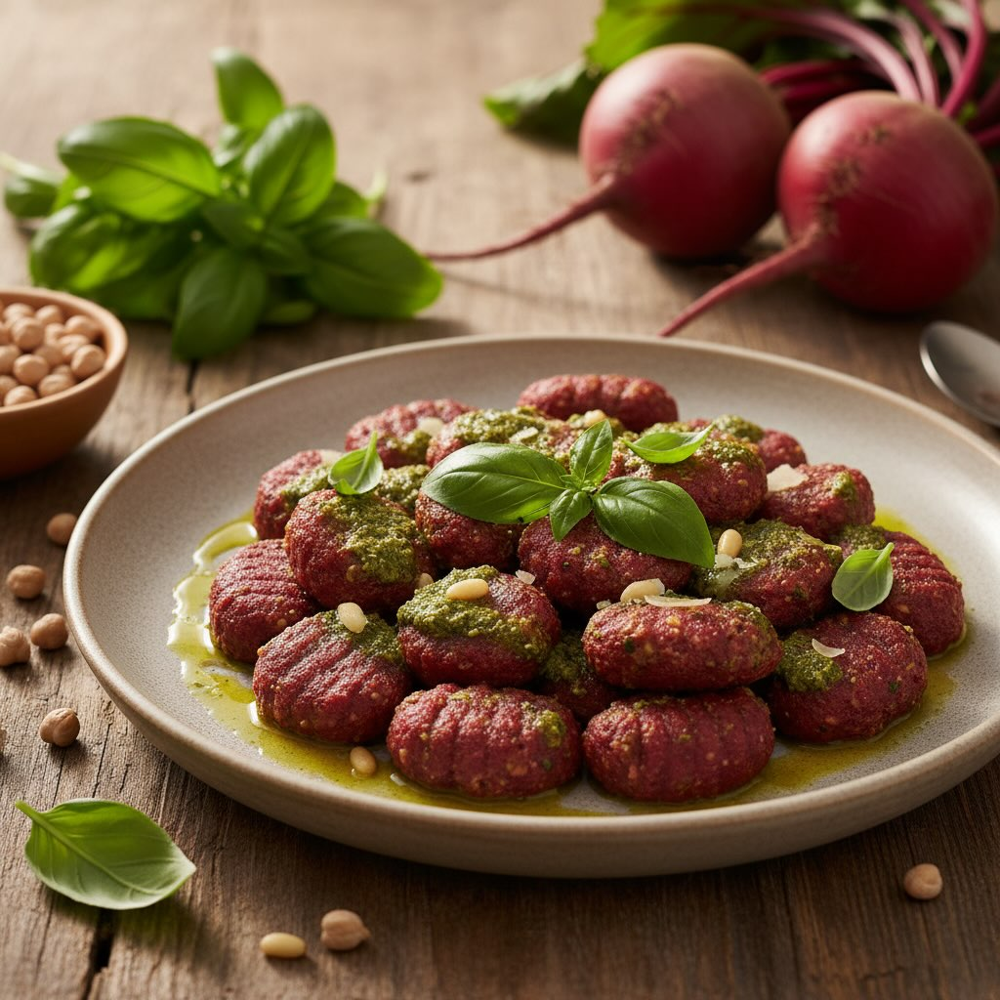

# Ingredienti - 200 g di barbabietole rosse cotte (in forno, al vapore o bollite) 

Ingredienti - 200 g di barbabietole rosse cotte (in forno, al vapore o bollite) - 150 g di ceci già lessati e scolati (in scatola o da voi cotti) - 180 g di farina di avena (+ q.b. per spolverare) - ½ cucchiaino di sale fino - Acqua tiepida q.b. (30–50 ml) - Olio extravergine d’oliva q.b. Per il pesto alla genovese - 50 g di foglie di basilico fresco - 30 g di pinoli (o noci) - 1 spicchio d’aglio (facoltativo, a piacere) - 60 ml di olio extravergine d’oliva - 20 g di Parmigiano Reggiano grattugiato - Sale grosso q.b. Procedimento (ridotto del 30%) 1. Barbabietole e ceci Se non cotte, lessate le barbabietole per 30–40 min o arrostitele a 200 °C per 45 min, poi sbucciatele e riducetele a pezzi. Scolate i ceci e tenete da parte un po’ della loro acqua. 2. Impasto Frullate barbabietole, ceci, sale e 20 ml dell’acqua tenuta da parte, fino a crema. Trasferite in una ciotola e incorporate la farina di avena a cucchiaiate, aggiungendo acqua tiepida o dei ceci se serve, fino a ottenere un composto morbido ma lavorabile. 3. Formatura Portate a ebollizione acqua salata. Con due cucchiai formate delle quenelle o, su un piano infarinato, ricavate cilindri di 2 cm, tagliate a tocchetti e arrotondate con le mani. 4. Cottura Cuocete gli gnocchi per 15 min nel bollore; scolateli appena galleggiano. 5. Pesto Frullate basilico, pinoli, aglio (se lo usate), olio, Parmigiano e sale grosso fino a una crema omogenea. 6. Impiattamento Disponete gli gnocchi caldi, conditeli con 2–3 cucchiai di pesto e un filo d’olio. Guarnite con foglie di basilico o pinoli tostati, se vi piace.

---

*Ricetta da @leguminando*
