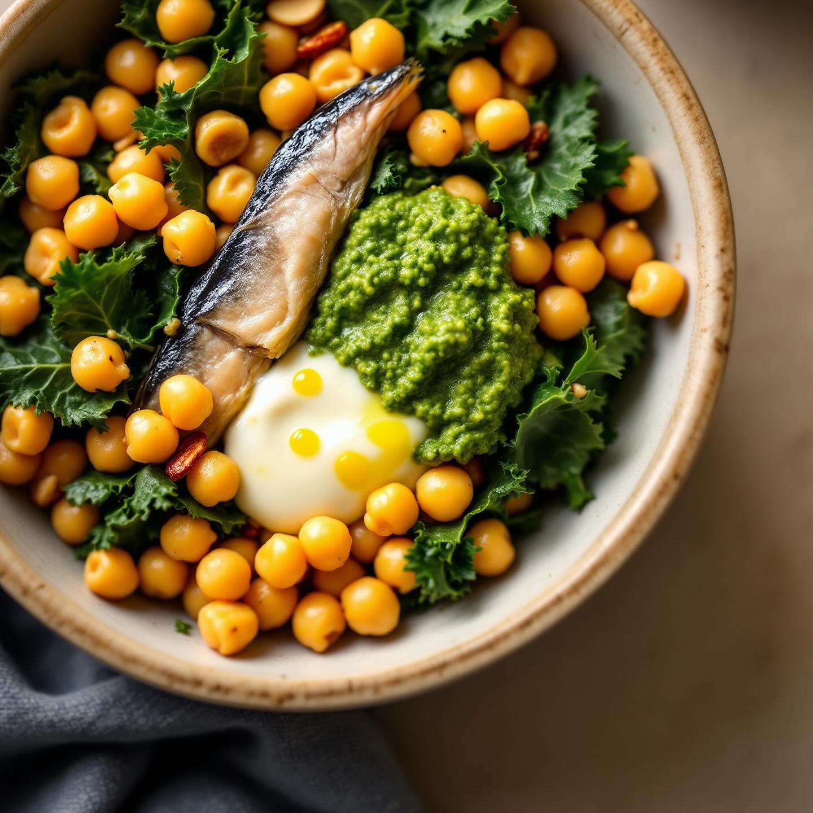

# Ingredienti - 200 g di ceci già lessati (in barattolo o home-made) - 200 g di ca

Ingredienti - 200 g di ceci già lessati (in barattolo o home-made) - 200 g di cavolo nero (solo le foglie) - 8 filetti di alici sott’olio, sgocciolati - 30 g di pinoli - 2 spicchi d’aglio - 4 cucchiai di olio extravergine d’oliva (+ q.b.) - 1/2 limone (succo) - sale e pepe nero macinato fresco - peperoncino in fiocchi (facoltativo) Procedimento 1) Preparazione del cavolo nero a) Elimina la costa centrale delle foglie, sciacqua e asciuga. b) Tagliale a striscioline larghe circa 1 cm. c) In una padella ampia scalda 2 cucchiai d’olio, aggiungi uno spicchio d’aglio schiacciato e un pizzico di peperoncino. d) Quando l’aglio comincia a sfrigolare, unisci il cavolo nero, sala leggermente e fai saltare a fiamma medio-alta per 5–6 minuti, finché sarà morbido ma ancora vivace. Togli dal fuoco e metti da parte. 2) Preparazione dei ceci a) Nella stessa padella, aggiungi un filo d’olio se serve e lo spicchio d’aglio rimasto schiacciato. b) Unisci i ceci scolati, sala con moderazione e falle insaporire per 4–5 minuti, mescolando spesso. c) A fine cottura irrorali con metà del succo di limone e una macinata di pepe. Trasferisci i ceci nel piatto con il cavolo. 3) Pesto di alici e pinoli a) In un padellino antiaderente tostati i pinoli a fuoco dolce per 2–3 minuti, girandoli spesso (devono dorarsi senza bruciare). b) Nel bicchiere di un frullatore o con il pestello in un mortaio, unisci i pinoli tostati, i filetti di alici, 4 cucchiai d’olio e un pizzico di pepe. c) Frulla (o pesta) fino a ottenere una crema liscia e omogenea. Se risulta troppo densa, aggiungi un filo d’olio a crudo o qualche goccia di limone. 4) Composizione del piatto a) Riponi in ogni ciotola metà del cavolo nero e dei ceci. b) Versa al centro un cucchiaio abbondante di pesto di alici e pinoli. c) Completa con un filo d’olio a crudo e, se ti piace, un’ultima spruzzata di limone.

---

*Ricetta da @leguminando*
