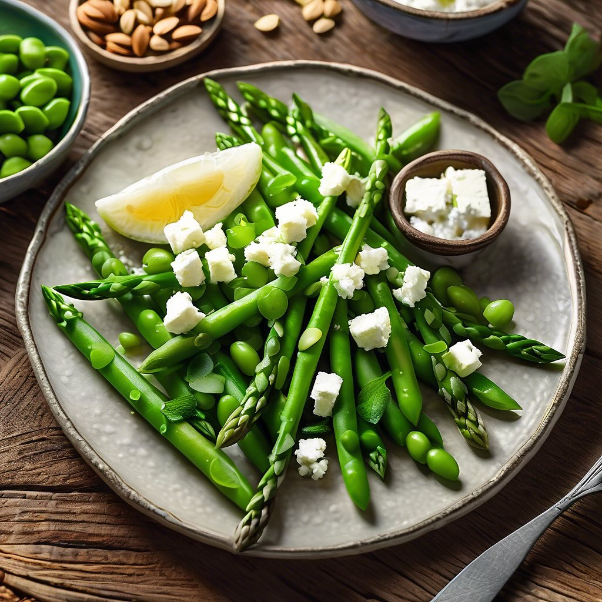

# ## Ingredienti: - 200 g di tonno affumicato - 150 g di fagioli bianchi (cotti e 

## Ingredienti: - 200 g di tonno affumicato - 150 g di fagioli bianchi (cotti e scolati) - 150 g di fagiolini o asparagi freschi - 2 cucchiai di olio d’oliva - Succo di 1 limone - Sale e pepe q.b. - Prezzemolo fresco tritato per guarnire ### Procedimento: 1. **Preparare gli asparagi o i fagiolini**: Se utilizzi gli asparagi, elimina la parte legnosa e lessali in acqua salata per circa 3-4 minuti, fino a quando sono teneri ma ancora croccanti. Scolali e immergili in acqua fredda per fermare la cottura. Se usi i fagiolini, segui lo stesso procedimento. 2. **Preparare i fagioli**: In una ciotola, mescola i fagioli bianchi con un cucchiaio di olio d’oliva, il succo di limone, sale e pepe. Lascia riposare per far insaporire. 3. **Assemblare il piatto**: Su un piatto da portata, disponi i fagioli come base. Aggiungi le punte di asparagi o i fagiolini sopra i fagioli. 4. **Aggiungere il tonno**: Taglia il tonno affumicato a fette e adagia le fette sopra il letto di fagioli e asparagi. 5. **Guarnire**: Completa con un filo d’olio d’oliva, una spolverata di sale e pepe e del prezzemolo fresco tritato. 6. **Servire**: Presenta il piatto come antipasto fresco e gustoso.

---

*Ricetta da @leguminando*
