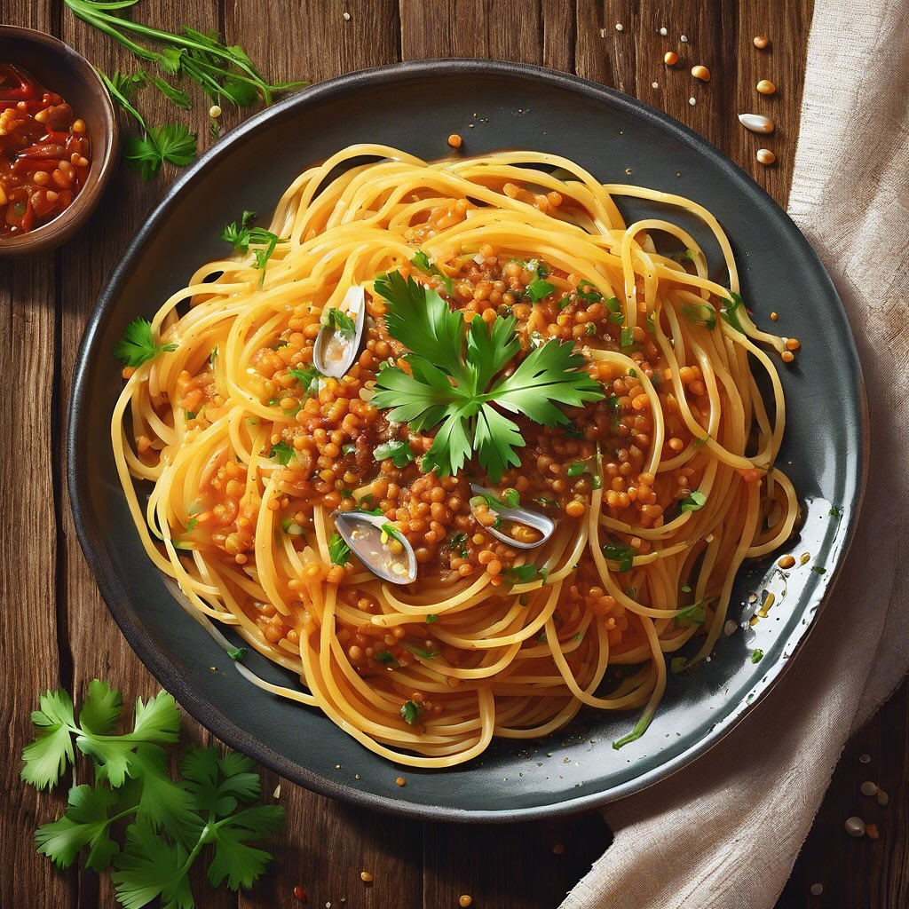

# ### Ingredienti: - 250 g di spaghetti di lenticchie gialle e rosse - 4-5 acciugh

### Ingredienti: - 250 g di spaghetti di lenticchie gialle e rosse - 4-5 acciughe sott’olio - 2 spicchi d’aglio - 1 peperoncino (facoltativo) - Olio extravergine d’oliva - Sale e pepe q.b. - Prezzemolo fresco per guarnire ### Procedimento: 1. **Cottura della pasta**: Porta a ebollizione una pentola di acqua salata e cuoci gli spaghetti di lenticchie seguendo le istruzioni sulla confezione. Una volta cotti, scolali e conserva un po’ dell’acqua di cottura. 2. **Preparazione del condimento**: In una padella grande, scalda un filo d’olio d’oliva. Aggiungi gli spicchi d’aglio tritati e il peperoncino, se lo usi. Fai rosolare per un paio di minuti. 3. **Aggiunta delle acciughe**: Unisci le acciughe e mescola fino a quando si sciolgono nell’olio, creando un condimento saporito. 4. **Unire la pasta**: Aggiungi gli spaghetti di lenticchie nella padella con il condimento. Mescola bene, aggiungendo un po’ dell’acqua di cottura per rendere il tutto più cremoso. 5. **Regola di sale e pepe**: Assaggia e aggiusta di sale e pepe secondo il tuo gusto. 6. **Servizio**: Servi gli spaghetti caldi, guarniti con prezzemolo fresco tritato e un filo d’olio d’oliva.

---

*Ricetta da @leguminando*
