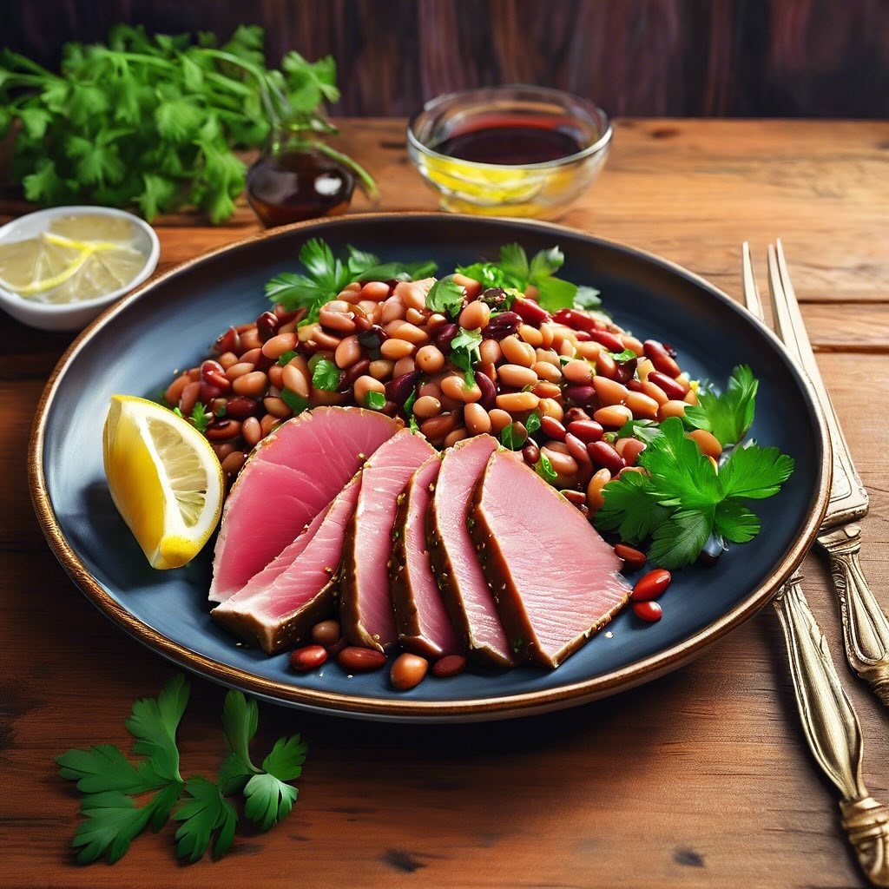

# ## Ingredienti: - 300 g di fette di tonno affumicato - 200 g di fagioli borlotti

## Ingredienti: - 300 g di fette di tonno affumicato - 200 g di fagioli borlotti (cotti, freschi o in scatola) - 2 cucchiai di aceto balsamico - 3 cucchiai di olio extravergine d’oliva - 1 spicchio d’aglio - Sale e pepe q.b. - Prezzemolo fresco tritato (per guarnire) - Limone (facoltativo, per servire) ### Procedimento: 1. **Preparare i fagioli**: Se utilizzi fagioli freschi, lessali in acqua salata finché non sono teneri. Se usi fagioli in scatola, scolali e risciacquali sotto acqua corrente. 2. **Sauté dei fagioli**: In una padella, riscalda 2 cucchiai di olio extravergine d’oliva e aggiungi lo spicchio d’aglio schiacciato. Fai soffriggere per un paio di minuti, quindi aggiungi i fagioli borlotti. Cuoci per circa 5-7 minuti, mescolando di tanto in tanto. Aggiungi sale e pepe a piacere. 3. **Aggiungere l’aceto**: Una volta che i fagioli sono caldi, aggiungi l’aceto balsamico e mescola bene. Cuoci per un altro minuto, quindi togli dal fuoco. 4. **Servire**: Su un piatto da portata, disponi le fette di tonno affumicato. Accanto, aggiungi i fagioli borlotti saltati. Irrora il tutto con un filo d’olio d’oliva e, se desideri, qualche goccia di aceto balsamico. 5. **Guarnire**: Cospargi con prezzemolo fresco tritato e, se ti piace, aggiungi qualche spicchio di limone per un tocco di freschezza. 6. **Gustare**: Servire subito, accompagnato da pane croccante o grissini.

---

*Ricetta da @leguminando*
