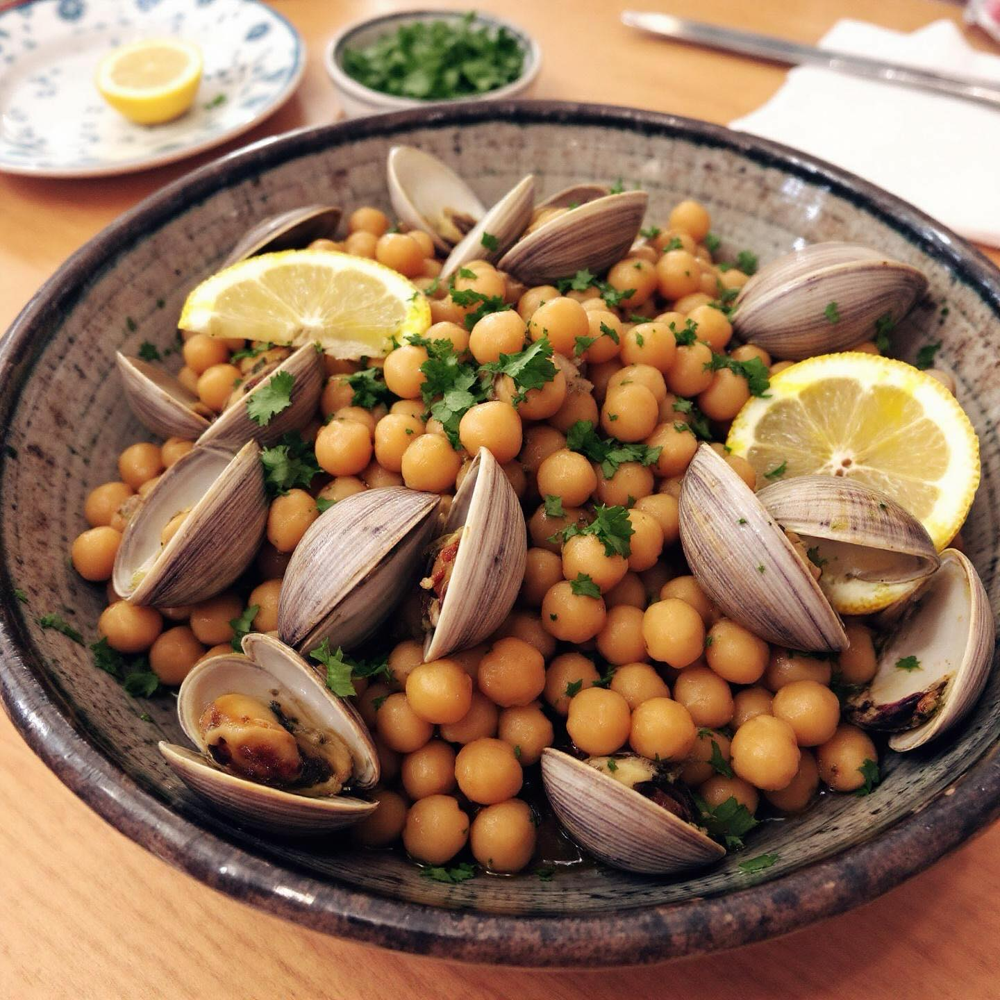

# #### Ingredienti: - 400 g di ceci lessati (in scatola o freschi) - 500 g di vong

#### Ingredienti: - 400 g di ceci lessati (in scatola o freschi) - 500 g di vongole - 2 spicchi d’aglio - 1 peperoncino fresco (opzionale) - 4 cucchiai di olio extravergine d’oliva - Prezzemolo fresco tritato - Succo di 1 limone - Sale e pepe q.b. #### Preparazione: 1. **Preparazione delle vongole**: Inizia sciacquando le vongole sotto acqua fredda corrente per rimuovere eventuali residui di sabbia. Metti le vongole in una ciotola con acqua e un po’ di sale per circa un’ora per farle spurgare. 2. **Rosolare l’aglio**: In una padella capiente, scalda l’olio d’oliva a fuoco medio. Aggiungi gli spicchi d’aglio schiacciati e il peperoncino (se lo usi). Fai rosolare fino a quando l’aglio diventa dorato. 3. **Cuocere le vongole**: Aggiungi le vongole nella padella e copri con un coperchio. Cuoci per circa 5-7 minuti, finché le vongole si aprono. Scarta quelle che rimangono chiuse. 4. **Aggiungere i ceci**: Una volta che le vongole sono pronte, aggiungi i ceci lessati nella padella. Mescola bene e cuoci per altri 2-3 minuti per far amalgamare i sapori. 5. **Condire**: Aggiusta di sale e pepe a piacere. Spremi il succo di limone e aggiungi il prezzemolo fresco tritato. Mescola bene. 6. **Servire**: Trasferisci il composto su un piatto da portata e guarnisci con ulteriori foglie di prezzemolo e fette di limone.

---

*Ricetta da @leguminando*
