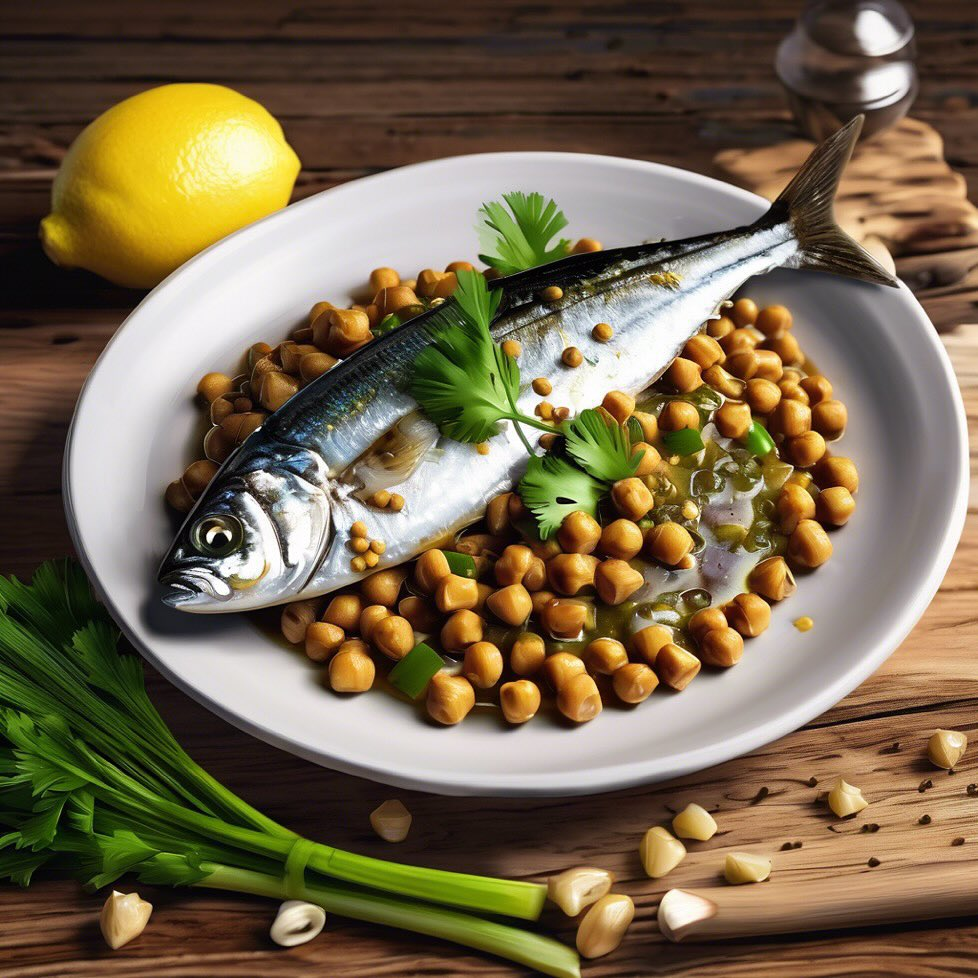

# ## Ingredienti - 400 g di sarde fresche - 200 g di ceci marroni (già cotti o in 

## Ingredienti - 400 g di sarde fresche - 200 g di ceci marroni (già cotti o in scatola) - 2 porri - 2 spicchi d’aglio - Olio extravergine d’oliva - Sale q.b. - Pepe nero q.b. - Prezzemolo fresco tritato (per guarnire) - Limone (per servire) ### Procedimento 1. **Preparazione delle sarde**: Se le sarde non sono già pulite, rimuovi le interiora e le teste, quindi lavale sotto acqua corrente e asciugale delicatamente. 2. **Cottura dei porri**: Affetta i porri a rondelle sottili e trita finemente gli spicchi d’aglio. In una padella grande, scalda un filo d’olio extravergine d’oliva e aggiungi i porri e l’aglio. Fai soffriggere a fuoco medio fino a quando i porri diventano teneri e trasparenti. 3. **Aggiunta dei ceci**: Aggiungi i ceci marroni nella padella con i porri e l’aglio. Mescola bene e lascia cuocere per circa 5-7 minuti, aggiustando di sale e pepe. 4. **Cottura delle sarde**: In un’altra padella, scalda un po’ d’olio e aggiungi le sarde. Cuoci a fuoco medio per circa 2-3 minuti per lato, fino a quando sono dorate e cotte. Puoi aggiungere un pizzico di sale e pepe. 5. **Assemblaggio del piatto**: Una volta che le sarde sono pronte, disponile sopra il letto di ceci e porri. Guarnisci con prezzemolo fresco tritato e serve con spicchi di limone a lato.

---

*Ricetta da @leguminando*
