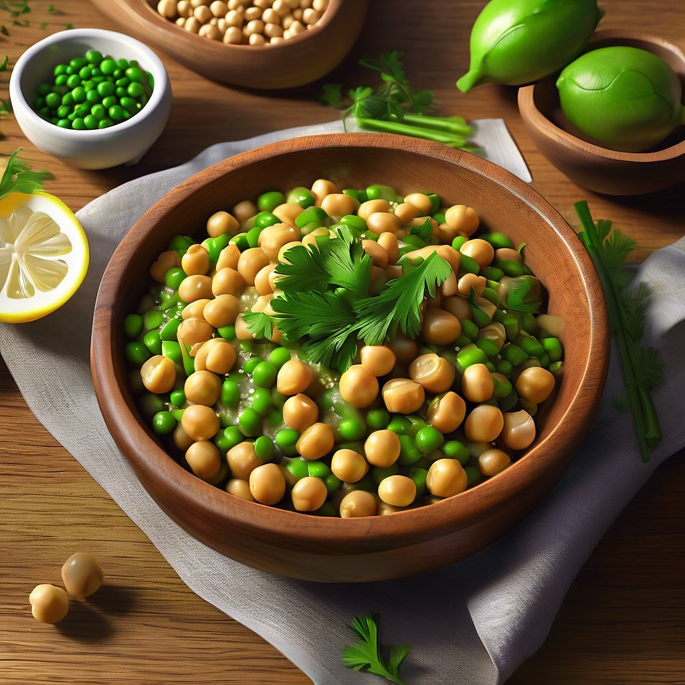

# ## Ingredienti: - 4 fette di pane casereccio (meglio se toscano) - 200 g di cavo

## Ingredienti: - 4 fette di pane casereccio (meglio se toscano) - 200 g di cavolo nero - 50 g di parmigiano reggiano in scaglie - 2 spicchi d’aglio - Olio extravergine d’oliva q.b. - Sale e pepe q.b. - Peperoncino (facoltativo) ### Procedimento: 1. **Preparare il cavolo nero**: Lavare le foglie di cavolo nero, rimuovere le costole più dure e tagliarle a striscioline. In una pentola, portare a ebollizione dell’acqua salata e sbollentare le foglie di cavolo per circa 5 minuti. Scolarle e raffreddarle sotto acqua fredda per mantenere il colore. 2. **Soffriggere l’aglio**: In una padella, scaldare un paio di cucchiai d’olio extravergine d’oliva e aggiungere gli spicchi d’aglio sbucciati e schiacciati. Farli dorare leggermente. 3. **Cuocere il cavolo**: Aggiungere il cavolo nero sbollentato nella padella con l’aglio. Condire con sale, pepe e, se desiderato, un pizzico di peperoncino. Cuocere a fuoco medio per circa 10 minuti, fino a quando il cavolo sarà tenero e ben insaporito. 4. **Preparare i crostoni**: Nel frattempo, tostare le fette di pane su una griglia o in forno fino a quando saranno dorate e croccanti. 5. **Assemblare i crostoni**: Distribuire il cavolo nero cotto sulle fette di pane tostato. Aggiungere generosamente le scaglie di parmigiano sopra il cavolo. 6. **Servire**: I crostoni possono essere serviti caldi o a temperatura ambiente. Un filo d’olio d’oliva a crudo sopra ogni crostone darà un tocco finale delizioso.

---

*Ricetta da @leguminando*
