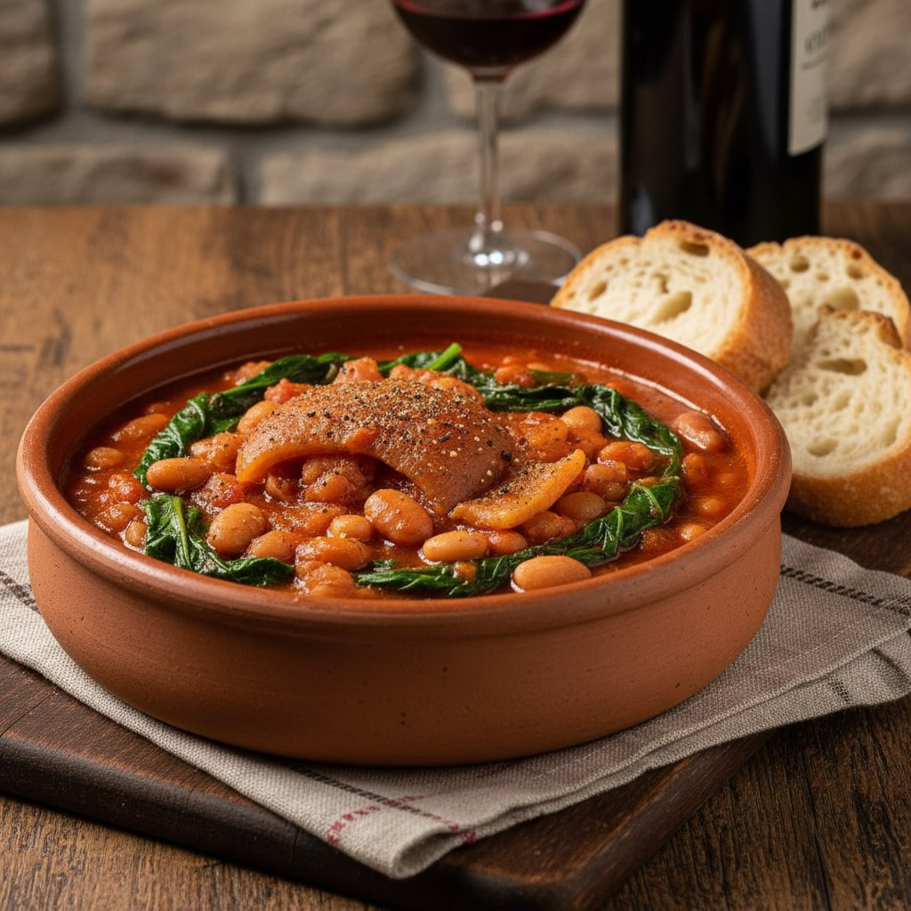

# ### Ingredienti - 500 g di cotiche di maiale - 300 g di fagioli borlotti secchi 

### Ingredienti - 500 g di cotiche di maiale - 300 g di fagioli borlotti secchi (o 2 lattine di fagioli precotti) - 1 mazzo di bietole - 1 cipolla - 2 spicchi d’aglio - 2 carote - 1 costa di sedano - 400 g di pomodori pelati - 2 foglie di alloro - Olio extravergine d’oliva - Sale e pepe q.b. - Peperoncino (opzionale) ## Preparazione 1. **Preparazione dei fagioli**: - Se usi fagioli secchi, mettili in ammollo in acqua fredda per almeno 8 ore o tutta la notte. Scolali e sciacquali. Cuocili in abbondante acqua fresca per circa 1-1,5 ore, fino a quando sono teneri. Scolali e tienili da parte. Se usi fagioli precotti, sciacquali e scolali. 2. **Preparazione delle cotiche**: - Fai bollire le cotiche in acqua per circa 30 minuti per ammorbidirle. Scolale, lasciale intiepidire e tagliale a strisce. 3. **Preparazione delle verdure**: - Lava le bietole e tagliale a pezzi. - Trita finemente la cipolla, l&#039;’glio, le carote e il sedano. 4. **Cottura**: - In una casseruola capiente, scalda un filo d&#039;’lio extravergine d&#039;’liva. Aggiungi la cipolla, l&#039;’glio, le carote e il sedano tritati. Fai soffriggere a fuoco medio finché le verdure non sono morbide. - Aggiungi le strisce di cotiche e rosolale per qualche minuto. - Unisci i pomodori pelati, schiacciandoli con una forchetta, e le foglie di alloro. Cuoci a fuoco lento per circa 30 minuti, mescolando di tanto in tanto. - Aggiungi i fagioli cotti e le bietole. Continua a cuocere per altri 15-20 minuti, finché le bietole sono tenere. - Regola di sale e pepe a piacere. Se gradito, aggiungi un pizzico di peperoncino per un po’ di piccantezza.

---

*Ricetta da @leguminando*
