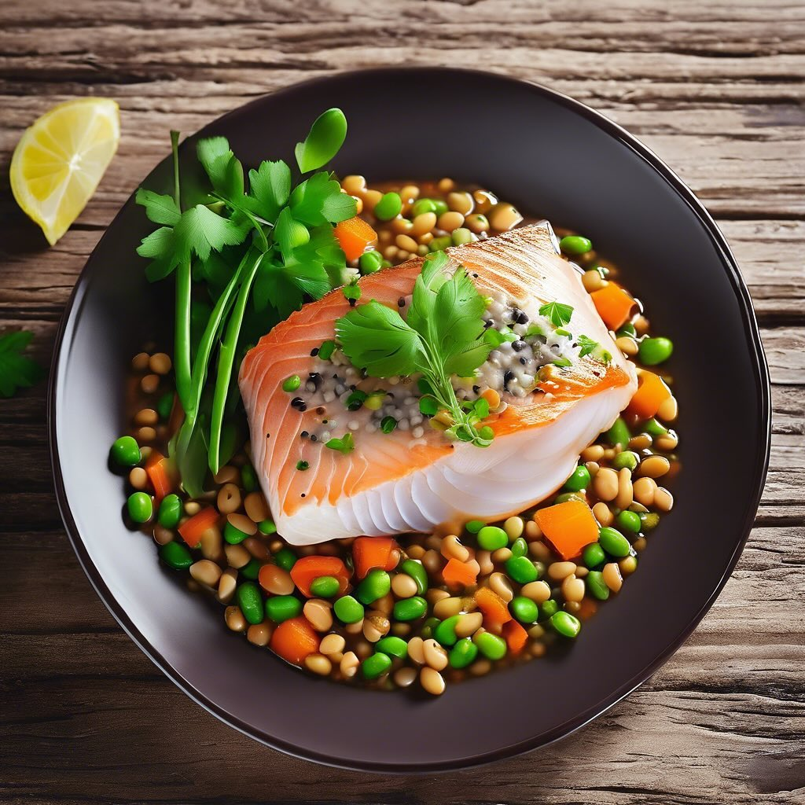

# ### Ingredienti - 500 g di pesce lesso (come merluzzo o tilapia) - 200 g di legu

### Ingredienti - 500 g di pesce lesso (come merluzzo o tilapia) - 200 g di legumi misti (come ceci, lenticchie e fagiolini) - 1 limone (a fette) - 2 cucchiai di olio d’oliva - Sale e pepe q.b. - Prezzemolo fresco per guarnire ### Preparazione 1. **Cuocere i legumi**: In una pentola, porta a ebollizione dell’acqua e cuoci i legumi misti finché non sono teneri. Scolali e mettili da parte. 2. **Cuocere il pesce**: In un’altra pentola, porta a ebollizione dell’acqua e aggiungi il pesce. Cuoci fino a quando non diventa tenero e si sfalda facilmente. 3. **Unire gli ingredienti**: Scola il pesce e uniscilo ai legumi in una ciotola grande. 4. **Condire**: Aggiungi l’olio d’oliva, sale, pepe e mescola delicatamente per amalgamare gli ingredienti. 5. **Servire**: Disponi il composto su un piatto da portata, guarnisci con le fette di limone e il prezzemolo fresco.

---

*Ricetta da @leguminando*
