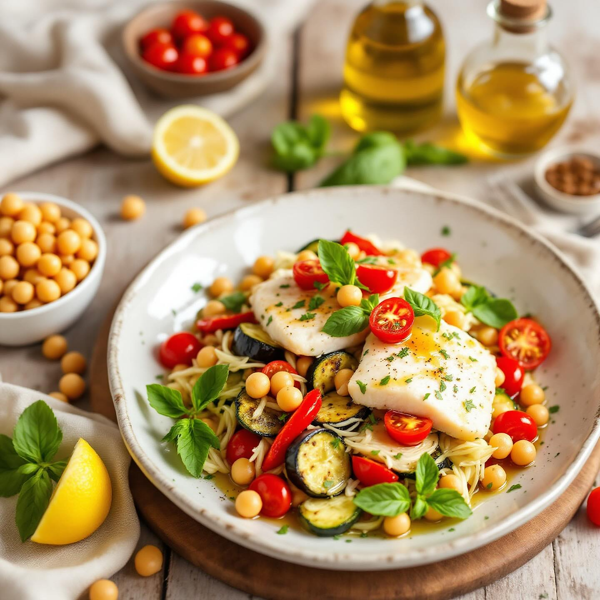

# Ingredienti - 600 g di filetti di merluzzo (o altro pesce bianco di vostra prefe

Ingredienti - 600 g di filetti di merluzzo (o altro pesce bianco di vostra preferenza) - 200 g di ceci già lessati (in alternativa 1 barattolo da 400 g) - 200 g di cannellini già lessati - 2 zucchine medie - 1 peperone rosso - 1 melanzana piccola - 8 pomodorini datterini - 1 spicchio d’aglio - Succo di 1 limone - 4 cucchiai di olio extra-vergine d’oliva - 1 cucchiaino di senape di Digione (facoltativa) - Una manciata di foglie di basilico e/o prezzemolo - Sale, pepe in grani, bacche di ginepro (facoltative) Preparazione 1. Preparare il pesce lesso a) In una casseruola capiente portate a bollore 1,5 l d’acqua con un gambo di sedano, una carota a pezzi, mezza cipolla, 2 foglie di alloro e qualche grano di pepe. b) Immergete i filetti di merluzzo e cuocete a fuoco dolce per 6–8 minuti dal ripristino del bollore. Spegnete, lasciate intiepidire nel liquido di cottura, scolateli e privateli della pelle, quindi sminuzzateli grossolanamente. 2. Grigliare le verdure a) Tagliate a fette oblique zucchine e melanzana, e a falde il peperone privato di semi e nervature interne. b) Scaldate una piastra o una griglia, ungetela leggermente con olio e cuocete le fette di verdura fino a ottenere le tipiche striature e la giusta tenerezza. c) Tagliatele a striscioline o dadini e tenetele da parte. 3. Preparare l’emulsione In una ciotolina mescolate: olio, succo di limone, senape, uno spicchio d’aglio schiacciato, sale e pepe. Sbattete con una forchetta fino a ottenere una vinaigrette omogenea. 4. Assemblaggio a) In una grande ciotola riunite il pesce spezzettato, i ceci e i cannellini scolati e leggermente sciacquati, le verdure grigliate e i pomodorini tagliati a metà. b) Condite con l’emulsione, fate amalgamare con delicatezza. c) Completate con foglioline di basilico o prezzemolo spezzettato a crudo e un giro di olio a crudo.

---

*Ricetta da @leguminando*
