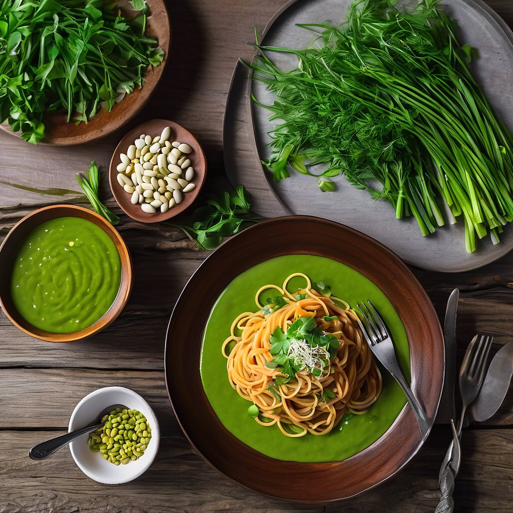

# ## Ingredienti: - **Per i pici:** - 300 g di farina di ceci - Acqua q

## Ingredienti: - **Per i pici:** - 300 g di farina di ceci - Acqua q.b. (circa 150-200 ml) - Un pizzico di sale - **Per il condimento:** - 150 g di pecorino romano grattugiato - 2-3 cucchiai di pepe nero macinato - 200 g di salsiccia di cinghiale - Un filo d’olio d’oliva - Prezzemolo fresco per guarnire (opzionale) ### Procedimento: 1. **Preparazione dei pici:** - In una ciotola, mescola la farina di ceci con un pizzico di sale. Aggiungi gradualmente l’acqua fino a ottenere un impasto liscio e omogeneo. - Copri l’impasto e lascialo riposare per circa 30 minuti. - Dopo il riposo, suddividi l’impasto in piccoli pezzi e stendili in forma di cordoncini spessi, lunghi circa 30 cm. Metti da parte. 2. **Cottura della salsiccia:** - In una padella, scalda un filo d’olio d’oliva e aggiungi la salsiccia di cinghiale, privandola della pelle e sbriciolandola. Cuoci fino a doratura. 3. **Cottura dei pici:** - Porta a ebollizione una pentola d’acqua salata e cuoci i pici per circa 4-5 minuti, fino a quando non salgono a galla. Scolali e conserva un po’ di acqua di cottura. 4. **Preparazione del condimento:** - Nella padella con la salsiccia, aggiungi i pici scolati. Mescola bene e aggiungi il pecorino grattugiato e il pepe nero. Se necessario, aggiungi un po’ di acqua di cottura per creare una crema. 5. **Servizio:** - Impiatta i pici cacio e pepe con salsiccia di cinghiale, guarnisci con prezzemolo fresco e una spolverata di pepe nero.

---

*Ricetta da @leguminando*
