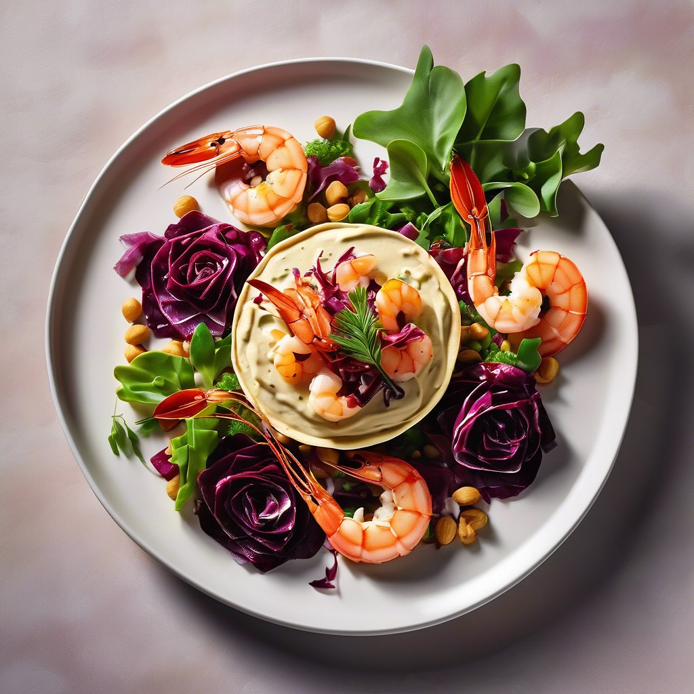

# ### Ingredienti - **Per la crema di ceci e mandorle:** - 200 g di ceci cotti - 5

### Ingredienti - **Per la crema di ceci e mandorle:** - 200 g di ceci cotti - 50 g di mandorle (preferibilmente tostate) - 2 cucchiai di olio d’oliva - Succo di mezzo limone - Sale e pepe q.b. - Qualche rametto di rosmarino (opzionale) - **Per la schiacciata croccante:** - 200 g di farina 00 - 100 ml di acqua - 2 cucchiai di olio d’oliva - Sale q.b. - **Per la guarnizione:** - 150 g di gamberetti sgusciati - 1 cespo di radicchio rosso - Olio d’oliva q.b. - Sale e pepe q.b. ### Preparazione 1. **Preparare la crema di ceci e mandorle:** - In un frullatore, unire i ceci, le mandorle, l’olio d’oliva, il succo di limone, sale e pepe. Frullare fino ad ottenere una crema liscia e omogenea. Se necessario, aggiungere un po’ d’acqua per raggiungere la consistenza desiderata. - Aggiungere il rosmarino tritato finemente se si desidera un tocco aromatico. 2. **Preparare la schiacciata croccante:** - Mescolare la farina e il sale in una ciotola. Aggiungere l’acqua e l’olio d’oliva, impastando fino ad ottenere un impasto liscio. - Dividere l’impasto in piccole palline e stenderle con un matterello fino a ottenere dei dischi sottili. - Cuocere in una padella antiaderente per circa 2-3 minuti per lato, fino a che non risultano dorati e croccanti. 3. **Cuocere i gamberetti:** - In una padella, scaldare un filo d’olio d’oliva e aggiungere i gamberetti. Cuocere per circa 2-3 minuti fino a quando diventano rosa e opachi. Aggiungere sale e pepe a piacere. 4. **Assemblare il piatto:** - Su un piatto da portata, spalmare un generoso strato di crema di ceci e mandorle. - Aggiungere sopra i gamberetti cotti e decorare con le foglie di radicchio rosso. - Servire con la schiacciata croccante a lato.

---

*Ricetta da @leguminando*
