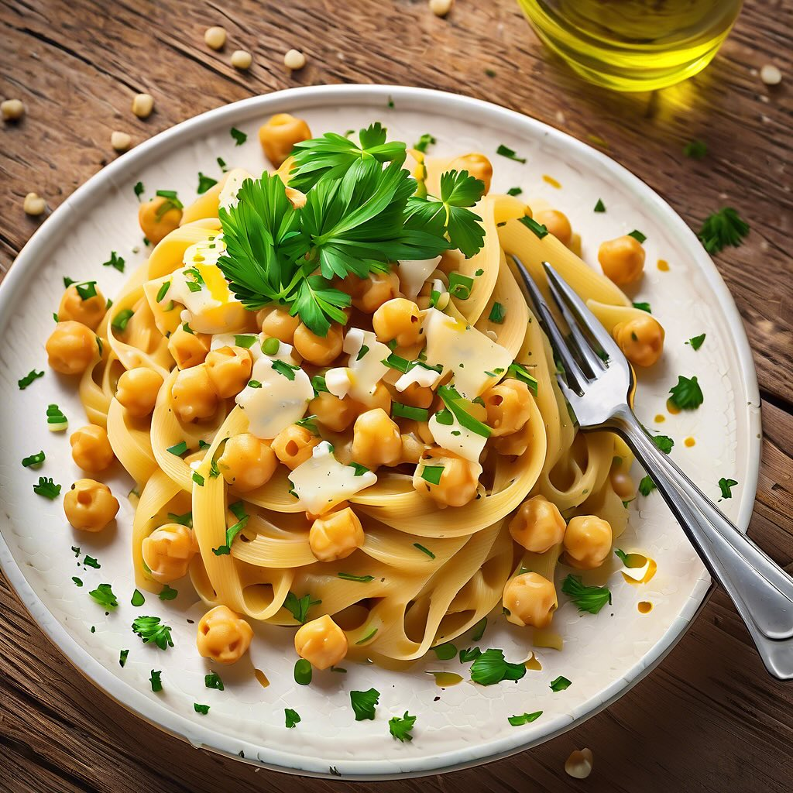

# ### Ingredienti - **Per la pasta:** - 200 g di farina di carrube - 100 g di fari

### Ingredienti - **Per la pasta:** - 200 g di farina di carrube - 100 g di farina di grano duro - 2 uova - Un pizzico di sale - Acqua q.b. - **Per il condimento:** - 250 g di ceci (cotti) - 150 g di provola piccante (a cubetti) - 2 spicchi d’aglio - Olio extravergine d’oliva q.b. - Peperoncino fresco o secco (a piacere) - Sale e pepe q.b. - Prezzemolo fresco (per guarnire) ### Procedimento 1. **Preparare la pasta:** - In una ciotola, mescola la farina di carrube con la farina di grano duro e il sale. - Fai un buco al centro e aggiungi le uova. Inizia a mescolare con una forchetta, incorporando gradualmente la farina. - Se l’impasto risulta troppo secco, aggiungi un po’ d’acqua, fino a ottenere un composto omogeneo. - Impasta energicamente per circa 10 minuti, poi copri con un panno e lascia riposare per 30 minuti. 2. **Cuocere i ceci:** - Se usi ceci secchi, mettili in ammollo per una notte e poi cuocili fino a renderli teneri. Se usi ceci in scatola, scolali e risciacquali. - In una padella, scalda un filo d’olio e aggiungi gli spicchi d’aglio schiacciati e il peperoncino. Fai rosolare per qualche minuto. - Aggiungi i ceci e cuoci per circa 5-7 minuti, aggiustando di sale e pepe. 3. **Cuocere la pasta:** - Stendi la pasta con un mattarello fino a uno spessore di circa 2 mm e tagliala nella forma desiderata (tagliatelle, pappardelle, ecc.). - Cuoci la pasta in abbondante acqua salata per 2-3 minuti, finché non viene a galla. 4. **Assemblare il piatto:** - Scola la pasta e trasferiscila nella padella con i ceci. Aggiungi anche i cubetti di provola piccante. - Mescola bene per far amalgamare gli ingredienti e sciogliere leggermente la provola. 5. **Servire:** - Impiatta e guarnisci con prezzemolo fresco tritato. Puoi aggiungere un filo d’olio a crudo e un po’ di peperoncino se ti piace.

---

*Ricetta da @leguminando*
