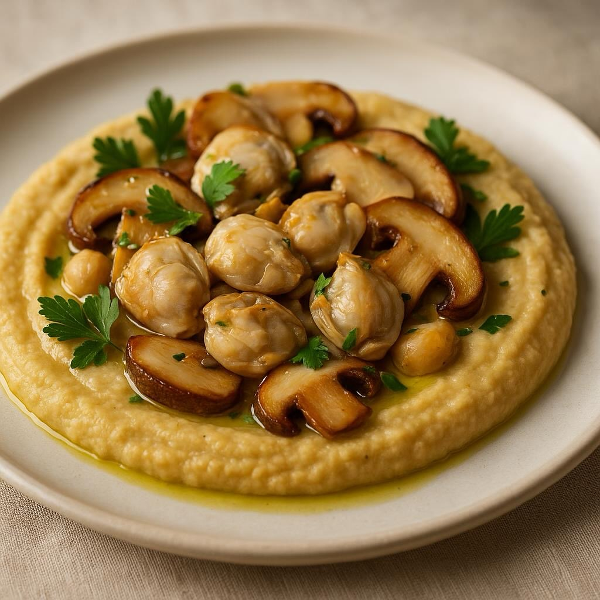

# ### Ingredienti - **Per le vongole e i funghi:** - 500 g di vongole senza guscio

### Ingredienti - **Per le vongole e i funghi:** - 500 g di vongole senza guscio - 200 g di funghi porcini freschi (o secchi, ammollati in acqua tiepida) - 2 spicchi d’aglio - 3 cucchiai di olio d’oliva extravergine - 1 bicchiere di vino bianco - Prezzemolo fresco tritato - Sale e pepe q.b. - **Per l’hummus di ceci:** - 400 g di ceci cotti (o in scatola, scolati e risciacquati) - 2 cucchiai di tahina (pasta di semi di sesamo) - Succo di un limone - 2 spicchi d’aglio - 3 cucchiai di olio d’oliva extravergine - Sale q.b. ## Procedimento 1. **Preparare l&#039;’ummus:** - In un frullatore, unisci i ceci, la tahina, il succo di limone, l&#039;’glio e l&#039;’lio d&#039;’liva. - Frulla fino a ottenere una crema liscia. Se necessario, aggiungi un po&#039;’d&#039;’cqua per raggiungere la consistenza desiderata. - Aggiusta di sale e metti da parte. 2. **Cucinare le vongole e i funghi:** - Pulisci i funghi porcini e tagliali a fette. - In una padella ampia, scalda l&#039;’lio d&#039;’liva e aggiungi l&#039;’glio tritato. Fai soffriggere finché non è dorato. - Aggiungi i funghi e cuoci per circa 5 minuti. - Versa le vongole nella padella e sfuma con il vino bianco. Cuoci fino a quando le vongole sono ben calde e il vino è evaporato. - Condisci con sale, pepe e prezzemolo tritato. 3. **Assemblare il piatto:** - Stendi l&#039;’ummus di ceci su un piatto da portata. - Adagia sopra le vongole e i funghi. - Guarnisci con un filo d&#039;’lio d’oliva e altro prezzemolo fresco.

---

*Ricetta da @leguminando*
