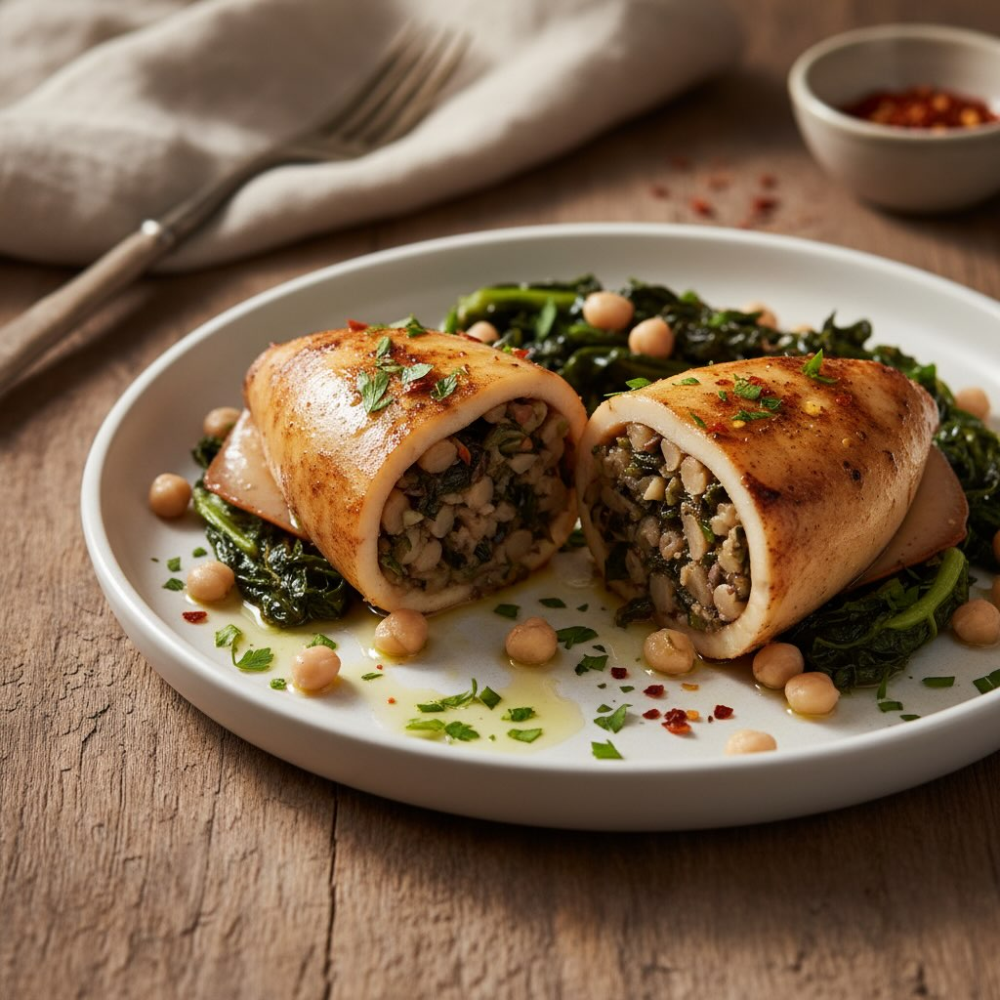

# ### Ingredienti - **Seppie**: 4 di medie dimensioni - **Cicerchie**: 200 g (già 

### Ingredienti - **Seppie**: 4 di medie dimensioni - **Cicerchie**: 200 g (già cotte) - **Cavolo nero**: 200 g - **Aglio**: 2 spicchi - **Peperoncino**: 1 piccolo (o a piacere) - **Olio extravergine d’oliva**: 4 cucchiai - **Prezzemolo fresco**: un mazzetto - **Sale e pepe**: q.b. - **Pane grattugiato**: 50 g - **Vino bianco**: 100 ml ## Procedimento 1. **Preparazione delle seppie**: - Pulire le seppie, rimuovendo l’osso e la pelle. Conservare i tentacoli. 2. **Preparazione del ripieno**: - Tritare finemente i tentacoli delle seppie, l&#039;’glio e il peperoncino. - In una padella, scaldare due cucchiai d&#039;’lio e soffriggere l&#039;’glio e il peperoncino. - Aggiungere i tentacoli tritati e cuocere per 5 minuti. - Unire le cicerchie e il cavolo nero tritato finemente. Continuare a cuocere per altri 5 minuti. - Aggiungere il prezzemolo tritato, sale, pepe e mescolare bene. - Togliere dal fuoco e incorporare il pane grattugiato per ottenere un composto omogeneo. 3. **Farcitura delle seppie**: - Riempire le seppie con il composto preparato, facendo attenzione a non esagerare per evitare che si rompano durante la cottura. Chiudere con uno stuzzicadenti. 4. **Cottura delle seppie**: - In una padella capiente, scaldare i restanti due cucchiai d’olio. - Aggiungere le seppie ripiene e rosolarle su entrambi i lati. - Sfumare con il vino bianco e lasciare evaporare l’alcol. - Ridurre la fiamma, coprire e cuocere per 20-25 minuti, finché le seppie saranno tenere. 5. **Servizio**: - Servire le seppie calde, guarnendo con altro prezzemolo fresco e un filo d’olio a crudo.

---

*Ricetta da @leguminando*
