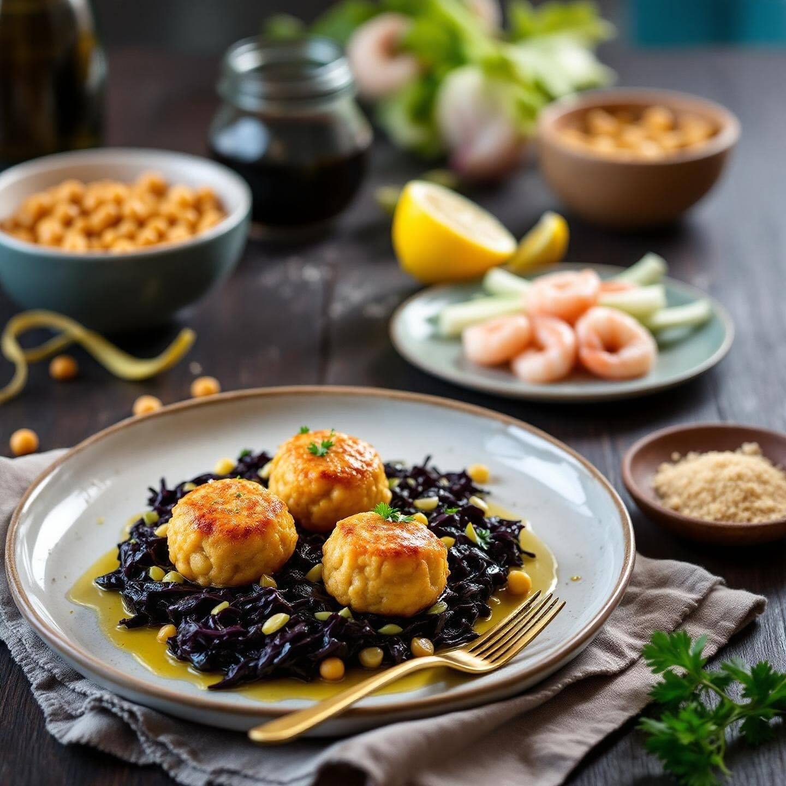

# Ingredienti (4 persone) • 240 g di ceci lessati (in barattolo o già cotti) • 300

Ingredienti (4 persone) • 240 g di ceci lessati (in barattolo o già cotti) • 300 g di code di gambero (sgusciate e pulite) • 1 uovo medio • 2–3 cucchiai di pangrattato (più un filo extra per infarinare) • 1 spicchio d’aglio • Prezzemolo fresco tritato (circa 2 cucchiai) • Scorza grattugiata di ½ limone (non trattato) • Sale, pepe nero q.b. • Olio extravergine d’oliva Per il contorno • 200 g di foglie di cavolo nero (solo le foglie esterne, ben pulite) • 2 porri (solo la parte bianca e verde chiaro), tagliati a rondelle sottili • 1 cucchiaio di olio EVO • Un pizzico di sale Preparazione 1. Prepara la base delle polpette a. Frulla i ceci ben scolati con l’aglio, la scorza di limone, sale e pepe, fino a ottenere una crema grossolana. b. Trita a coltello le code di gambero (lascia qualche pezzetto più grosso per la consistenza). c. In una ciotola unisci i ceci frullati, i gamberi tritati, l’uovo, il prezzemolo e 2 cucchiai di pangrattato. Mescola: l’impasto deve essere modellabile senza risultare appiccicoso. Se serve, aggiungi altro pangrattato. 2. Forma e cuoci le polpette a. Con le mani leggermente infarinate, forma delle palline di circa 30 g l’una. b. Scalda un velo di olio in padella antiaderente a fuoco medio. c. Adagia le polpette e lasciale rosolare 3–4 minuti per lato, finché diventano dorate. 3. Salta cavolo nero e porri a. In un’altra padella scalda 1 cucchiaio di olio. b. Aggiungi i porri a rondelle: falla appassire 2 minuti a fuoco dolce. c. Unisci le foglie di cavolo nero spezzettate, regola di sale e cuoci coperto per 5–6 minuti, mescolando di tanto in tanto. 4. Impiattamento • Distribuisci sul piatto uno strato di cavolo e porri, sistema le polpette di ceci e gamberi sopra. • Completa con un filo d’olio a crudo e una leggera spruzzata di limone se ti piace. Varianti e consigli • In forno: cuoci le polpette 15–18 minuti a 180 °C su carta forno, girandole a metà cottura. • Speziature: un pizzico di paprika affumicata o cumino nei ceci dà un twist in più. • Gluten free: sostituisci il pangrattato con farina di riso o fiocchi d’avena tritati.

---

*Ricetta da @leguminando*
