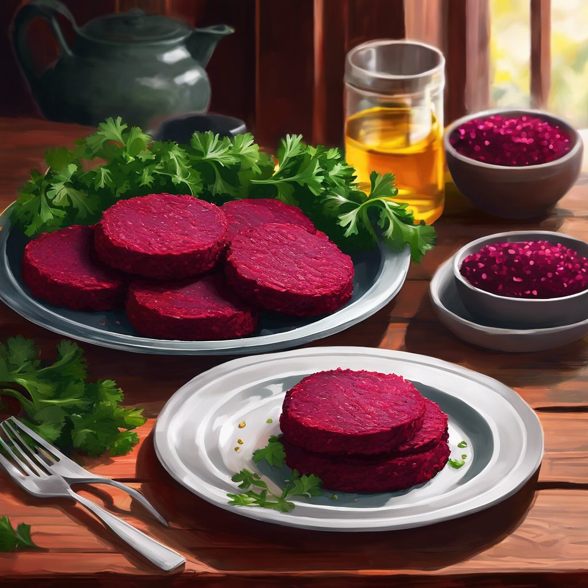

# ### Ingredienti **Per i medaglioni:** - 300 g di rape rosse (già cotte e pelate)

### Ingredienti **Per i medaglioni:** - 300 g di rape rosse (già cotte e pelate) - 200 g di farina di lenticchie rosse - 1 cipolla piccola, tritata finemente - 1 spicchio d’aglio, tritato - 1 cucchiaio di olio d’oliva - Sale e pepe q.b. - Paprika dolce (opzionale) - Prezzemolo fresco tritato (opzionale) **Per il cavolo nero:** - 200 g di cavolo nero, lavato e tagliato a strisce - 1 cucchiaio di olio d’oliva - 1 spicchio d’aglio, intero - Sale e pepe q.b. - Succo di limone (opzionale) ### Procedimento 1. **Preparare i medaglioni:** - In una padella, scaldare l’olio d’oliva e soffriggere la cipolla e l’aglio fino a doratura. - In una ciotola, schiacciare le rape rosse cotte con una forchetta fino a ottenere una purea. - Aggiungere la farina di lenticchie rosse, la cipolla e l’aglio soffritti, sale, pepe e paprika (se desiderato). Mescolare bene fino a ottenere un composto omogeneo. - Formare dei medaglioni della dimensione desiderata con le mani. - Scaldare un po’ d’olio in una padella antiaderente e cuocere i medaglioni per circa 4-5 minuti per lato, fino a quando non sono dorati. 2. **Preparare il cavolo nero:** - In un’altra padella, scaldare l’olio d’oliva e aggiungere l’aglio intero. Far rosolare leggermente. - Aggiungere il cavolo nero e cuocere a fuoco medio, mescolando di tanto in tanto, fino a quando il cavolo non si ammorbidisce (circa 5-7 minuti). - Aggiungere sale, pepe e un po’ di succo di limone se desiderato. 3. **Impiattare:** - Servire i medaglioni di rape rosse caldi accompagnati dal cavolo nero saltato.

---

*Ricetta da @leguminando*
