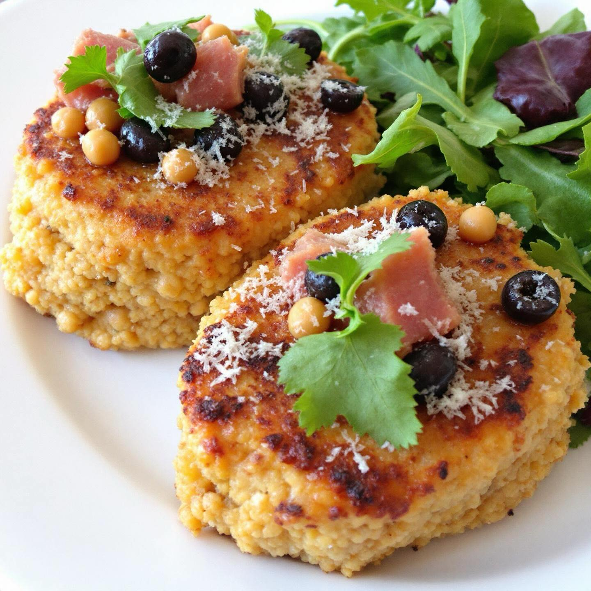

# #### Ingredienti: **Per le polpette:** - 200g di quinoa - 1 cucchiaio di olio ex

#### Ingredienti: **Per le polpette:** - 200g di quinoa - 1 cucchiaio di olio extravergine d’oliva - 1 cipolla piccola, tritata - 2 spicchi d’aglio, tritati - 1 carota, grattugiata - 100g di pangrattato - 1 uovo (o sostituto vegano) - Sale e pepe q.b. - Prezzemolo fresco, tritato (facoltativo) **Per il ripieno di hummus:** - 200g di ceci già cotti (in scatola o lessati) - 2 cucchiai di tahini (pasta di sesamo) - 2 cucchiai di succo di limone - 1 spicchio d’aglio - 50g di olive nere, denocciolate e tritate - 30g di capperi, sciacquati e tritati - 100g di tonno in scatola, sgocciolato - Sale e pepe q.b. #### Preparazione: 1. **Cottura della quinoa**: Sciacqua la quinoa sotto acqua corrente. In una pentola, porta a ebollizione 400 ml di acqua, aggiungi la quinoa e un pizzico di sale. Copri e cuoci a fuoco basso per circa 15 minuti, finché l’acqua è assorbita. Togli dal fuoco e lascia raffreddare. 2. **Preparazione dell’hummus**: In un frullatore, unisci i ceci, il tahini, il succo di limone, l’aglio, le olive, i capperi e il tonno. Frulla fino a ottenere un composto omogeneo. Aggiusta di sale e pepe a piacere. Trasferisci in una ciotola e metti da parte. 3. **Preparazione delle polpette**: In una padella, scalda l’olio d’oliva e fai soffriggere la cipolla e l’aglio fino a quando sono teneri. Aggiungi la carota grattugiata e cuoci per un altro paio di minuti. In una ciotola, unisci la quinoa cotta, le verdure soffritte, il pangrattato, l’uovo, il prezzemolo, il sale e il pepe. Mescola bene fino a ottenere un composto omogeneo. 4. **Formazione delle polpette**: Preleva una piccola quantità di composto di quinoa e forma una pallina. Fai un’incisione al centro e inserisci un cucchiaio di hummus, quindi richiudi la pallina attorno al ripieno e forma una polpetta. Ripeti fino a esaurire gli ingredienti. 5. **Cottura delle polpette**: Prepara una teglia foderata con carta da forno. Disponi le polpette sulla teglia e spennellale con un po’ di olio d’oliva. Cuoci in forno pre-riscaldato a 180°C per circa 25-30 minuti, girandole a metà cottura, finché sono dorate e croccanti.

---

*Ricetta da @leguminando*
