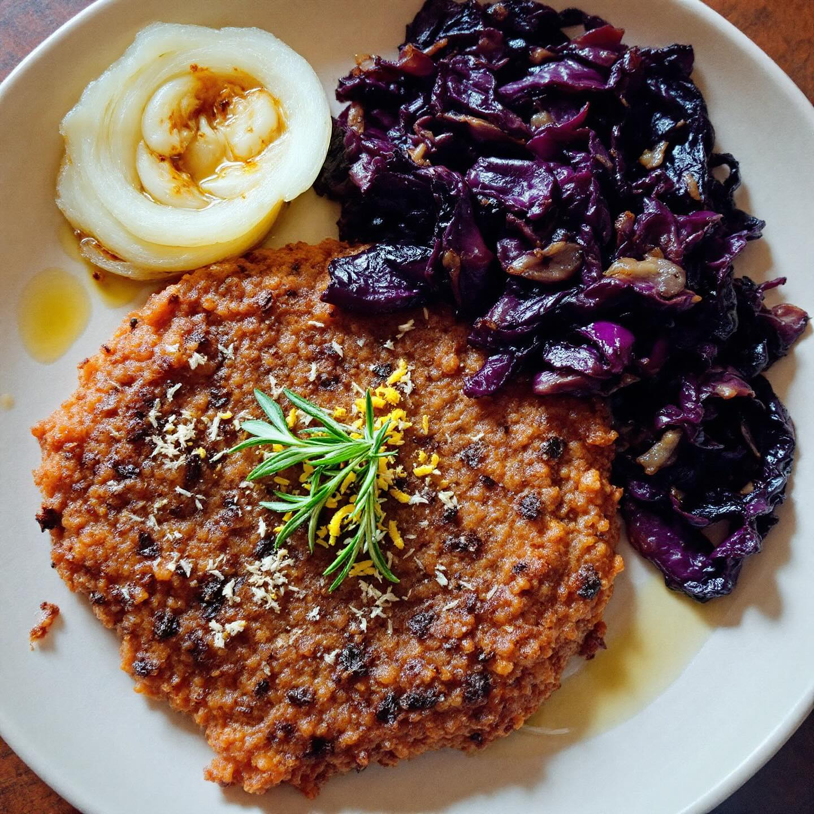

# Ingredienti • 200 g lenticchie rosse • 500 ml acqua • 3 cucchiai olio evo • sale

Ingredienti • 200 g lenticchie rosse • 500 ml acqua • 3 cucchiai olio evo • sale • aghi di 2 rametti di rosmarino • 2 cipolle bianche affettate • 1 cucchiaio zucchero di canna • 2 cucchiai olio evo • sale • 200 g cavolo nero • 300 g cavolo cappuccio a listarelle • 1 spicchio d’aglio • 1 cucchiaio aceto di mele • sale, pepe Procedimento 1. Frulla lenticchie, acqua, 3 cucchiai olio, sale e metà del rosmarino fino a crema. 2. Riposa 30′. Preriscalda il forno a 200 °C e ungi una teglia. 3. In padella caramella le cipolle con olio, sale e zucchero per 15–20′. 4. Versa la pastella nella teglia calda, cospargi rosmarino e cuoci 20–25′. 5. Aumenta a 220 °C, condisci il cavolo nero con olio e sale e tostalo 8–10′. 6. In un’altra padella scalda olio e aglio, unisci il cavolo cappuccio, sfuma con aceto, sala, pepa e cuoci 5–7′. 7. Impiatta la farinata, aggiungi cipolla caramellata e affianca cavolo nero e cappuccio.

---

*Ricetta da @leguminando*
