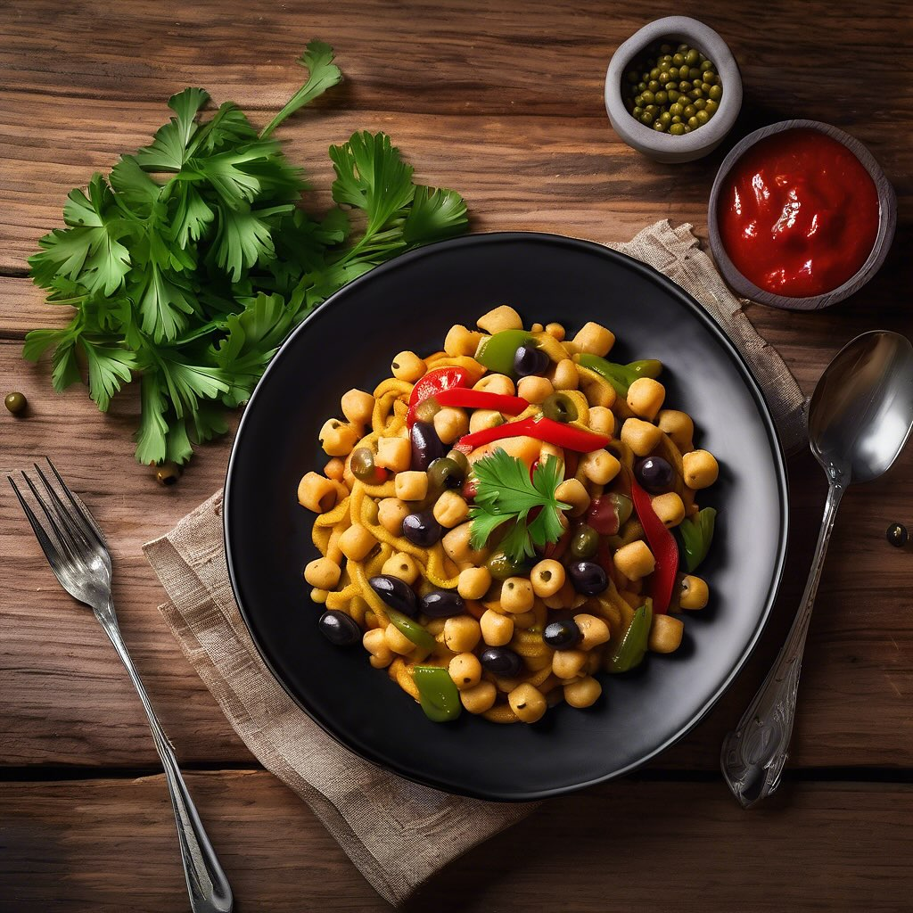

# ### Ingredienti: #### Per i Pici: - 200 g di farina di ceci - 100 g di farina 00

### Ingredienti: #### Per i Pici: - 200 g di farina di ceci - 100 g di farina 00 (per aiutare l’impasto a legare) - 150 ml di acqua - Un pizzico di sale #### Per la cottura: - 500 ml di vino rosso #### Per la Salsa: - 100 g di olive nere denocciolate - 100 g di olive verdi denocciolate - 2 cucchiai di capperi - 1 peperone rosso tagliato a strisce - 1 peperone giallo tagliato a strisce - 200 g di tonno fresco tagliato a cubetti - 2 spicchi d’aglio - 3 cucchiai di olio extravergine d’oliva - Sale e pepe q.b. - Prezzemolo fresco tritato (per guarnire) ### Preparazione: #### Preparazione dei Pici: 1. **Impasto:** - In una ciotola, mescola la farina di ceci con la farina 00 e un pizzico di sale. - Aggiungi gradualmente l’acqua, impastando fino ad ottenere un composto liscio ed elastico. - Copri l’impasto e lascialo riposare per circa 30 minuti. 2. **Formatura:** - Dopo il riposo, prendi piccoli pezzi di impasto e forma dei filoncini sottili e lunghi, tipici dei pici. - Disponi i pici su un piano infarinato per evitare che si attacchino. #### Cottura dei Pici: 3. **Cuoci nel Vino:** - Porta a ebollizione il vino rosso in una pentola capiente. - Cuoci i pici nel vino fino a quando non saranno al dente. Scolali e tieni da parte un po’ di vino di cottura. #### Preparazione della Salsa: 4. **Soffritto:** - In una padella grande, scalda l’olio d’oliva e aggiungi gli spicchi d’aglio schiacciati. - Aggiungi i cubetti di tonno e cuoci fino a quando non saranno dorati. Rimuovi l’aglio. 5. **Aggiungi le Verdure:** - Aggiungi i peperoni tagliati a strisce e cuoci fino a che non si ammorbidiscono. - Unisci le olive nere e verdi e i capperi, mescolando bene. 6. **Unisci i Pici:** - Aggiungi i pici scolati alla padella con la salsa, mescolando delicatamente per amalgamare il tutto. - Se necessario, aggiungi un po’ del vino di cottura per legare meglio il tutto. 7. **Condimento:** - Regola di sale e pepe a piacere. - Guarnisci con prezzemolo fresco tritato prima di servire.

---

*Ricetta da @leguminando*
