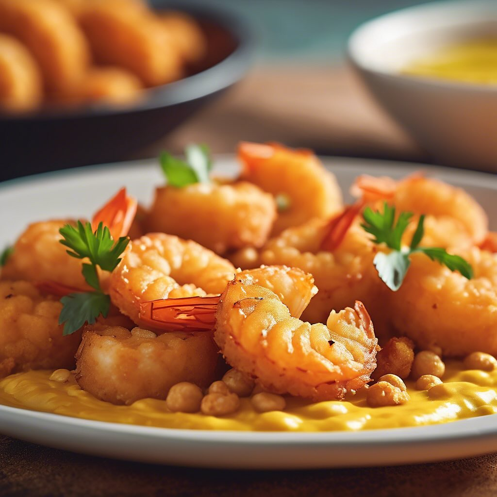

# ### Ingredienti #### Per i gamberoni fritti: - 400 g di gamberoni freschi, sgusc

### Ingredienti #### Per i gamberoni fritti: - 400 g di gamberoni freschi, sgusciati e puliti - 100 g di farina di lenticchie - 50 g di acqua frizzante (circa) - 1 cucchiaino di paprika dolce - Sale e pepe q.b. - Olio di semi per friggere #### Per l’hummus di ceci: - 200 g di ceci cotti (puoi usare quelli in scatola) - 2 cucchiai di tahini - 1 spicchio d’aglio - Succo di 1 limone - 2-3 cucchiai di olio extravergine d’oliva - Sale q.b. - Paprika e prezzemolo per guarnire (opzionale) ### Procedimento #### Preparazione dell’hummus: 1. In un mixer, unisci i ceci, il tahini, l’aglio, il succo di limone, l’olio d’oliva e il sale. 2. Frulla fino a ottenere una consistenza cremosa. Se necessario, aggiungi un po’ d’acqua per rendere l’hummus più morbido. 3. Assaggia e regola di sale e limone secondo il tuo gusto. 4. Trasferisci l’hummus in un piatto da portata e, se vuoi, guarnisci con paprika e prezzemolo. #### Preparazione dei gamberoni fritti: 1. In una ciotola, mescola la farina di lenticchie, la paprika, il sale e il pepe. 2. Aggiungi lentamente l’acqua frizzante, mescolando fino a ottenere una pastella liscia e cremosa. Dovrebbe avere una consistenza simile a quella della pastella per le fritture. 3. Riscalda l’olio in una padella profonda a fuoco medio-alto. 4. Immergi i gamberoni nella pastella, assicurandoti che siano ben ricoperti. 5. Friggi i gamberoni pochi alla volta fino a quando non sono dorati e croccanti (circa 2-3 minuti per lato). 6. Scolali su carta assorbente per eliminare l’olio in eccesso. #### Presentazione: 1. Distribuisci l’hummus di ceci nei piatti. 2. Adagia sopra i gamberoni fritti. 3. Servi immediatamente, magari accompagnando con una fetta di limone e un filo d’olio d’oliva.

---

*Ricetta da @leguminando*
