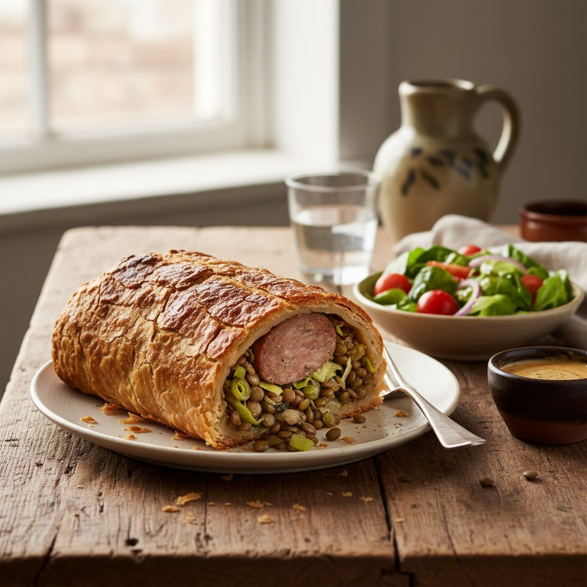

# ### Ingredienti ## Per il Cotechino - 1 cotechino (circa 500 g) - 200 g di lenti

### Ingredienti ## Per il Cotechino - 1 cotechino (circa 500 g) - 200 g di lenticchie cotte - 2 porri, tagliati a rondelle - 2 cucchiai di olio d&#039;o’iva - Sale e pepe q.b. Per la Crosta di Pane - 150 g di farina di carrube - 150 g di farina di lenticchie - 100 ml di acqua tiepida - 1 cucchiaino di lievito di birra secco - 1 cucchiaino di zucchero - 1 cucchiaio di olio d&#039;oliva’- 1 pizzico di sale Preparazione Preparazione della Crosta 1. **Attivare il lievito:** In una ciotola, sciogli il lievito e lo zucchero nell&#039;acqua tiepid’. Lascia riposare per 5-10 minuti finché non diventa schiumoso. 2. **Impasto:** In un’altra ciotola, mescola la farina di carrube e la farina di lenticchie con il sale. Aggiungi il composto di lievito e l&#039;olio d&#039;oliva’ Impas’a fino a ottenere un impasto omogeneo e liscio. Copri e lascia lievitare per circa 1 ora o fino al raddoppio. Preparazione del Ripieno 1. **Cuocere i porri:** In una padella, scalda l&#039;olio d&#039;oliva e a’giungi’i porri. Cuoci a fuoco medio finché non diventano morbidi. Aggiungi le lenticchie cotte, sale e pepe, e mescola bene. Lascia raffreddare. 2. **Preparare il cotechino:** Cuoci il cotechino secondo le istruzioni della confezione. Una volta cotto, rimuovi la pelle e lascialo raffreddare leggermente. Assemblaggio 1. **Stendere l&#039;impasto:** Su una su’erficie infarinata, stendi l&#039;impasto lievitato fi’o a ottenere un rettangolo abbastanza grande da avvolgere il cotechino. 2. **Riempire:** Distribuisci il mix di lenticchie e porri sull&#039;impasto, lasciando u’ bordo libero. Posiziona il cotechino al centro. 3. **Avvolgere:** Arrotola delicatamente l’impasto attorno al cotechino, sigillando bene i bordi. 4. **Cottura:** Posiziona il cotechino in crosta su una teglia rivestita di carta da forno. Cuoci in forno preriscaldato a 200°C per circa 25-30 minuti, finché la crosta non è dorata e croccante.

---

*Ricetta da @leguminando*
