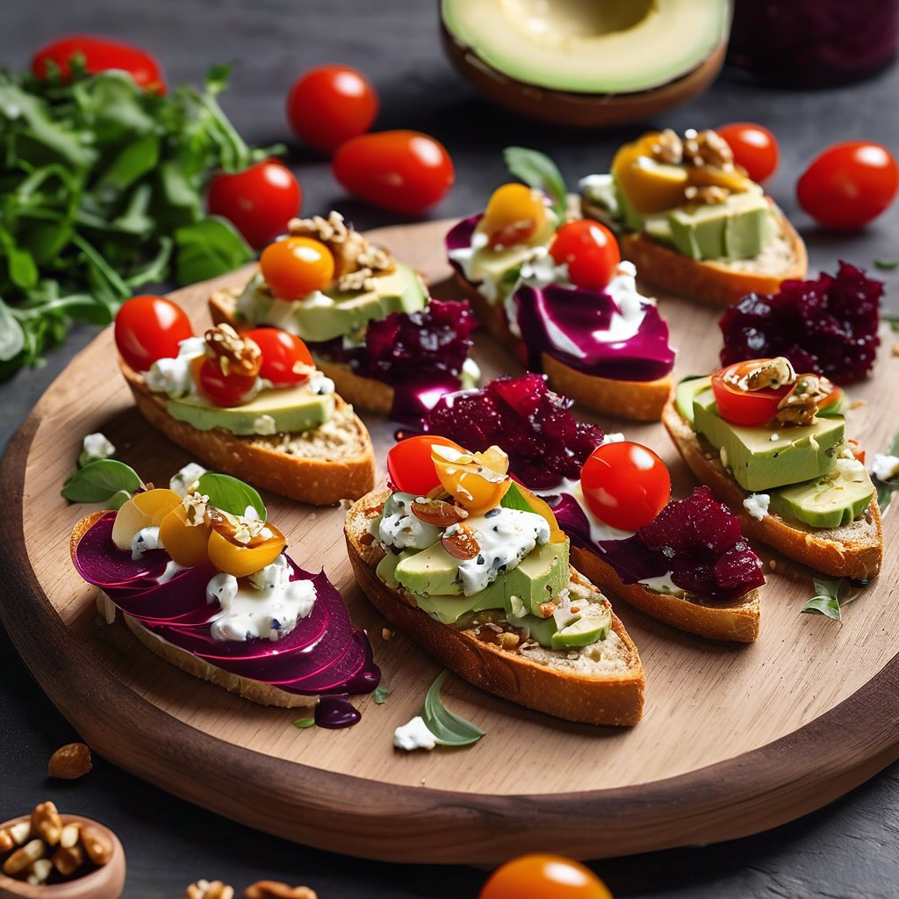

# ### Ingredienti: #### Per il crostino con crema di avocado e pomodorini: - 2 avo

### Ingredienti: #### Per il crostino con crema di avocado e pomodorini: - 2 avocado maturi - 150 g di pomodorini ciliegia - Succo di 1 limone - Sale e pepe q.b. - Pane per crostini #### Per il crostino con hummus di barbabietola e semi di sesamo: - 200 g di barbabietole cotte - 100 g di ceci cotti - 2 cucchiai di tahini - Succo di 1 limone - 2 cucchiai di olio d’oliva - Sale q.b. - Semi di sesamo per guarnire - Pane per crostini #### Per il crostino con gorgonzola e noci: - 150 g di gorgonzola - 50 g di noci tritate - Miele q.b. - Pane per crostini ### Preparazione: 1. **Crostino con crema di avocado e pomodorini:** - In una ciotola, schiacciare gli avocado e aggiungere il succo di limone, sale e pepe. Mescolare fino ad ottenere una crema omogenea. - Tostare le fette di pane e spalmare la crema di avocado. Guarnire con pomodorini ciliegia tagliati a metà. 2. **Crostino con hummus di barbabietola e semi di sesamo:** - Nel frullatore, unire le barbabietole, i ceci, il tahini, il succo di limone e l’olio d’oliva. Frullare fino ad ottenere una crema liscia. Aggiustare di sale. - Tostare le fette di pane e spalmare l’hummus di barbabietola. Cospargere con semi di sesamo. 3. **Crostino con gorgonzola e noci:** - In una ciotola, sbriciolare il gorgonzola e mescolarlo con le noci tritate. - Tostare le fette di pane e adagiare sopra il mix di gorgonzola e noci. Aggiungere un filo di miele per dolcificare. 4. **Impiattamento:** - Disporre i crostini su un piatto di portata, creando un bel contrasto di colori e sapori.

---

*Ricetta da @leguminando*
