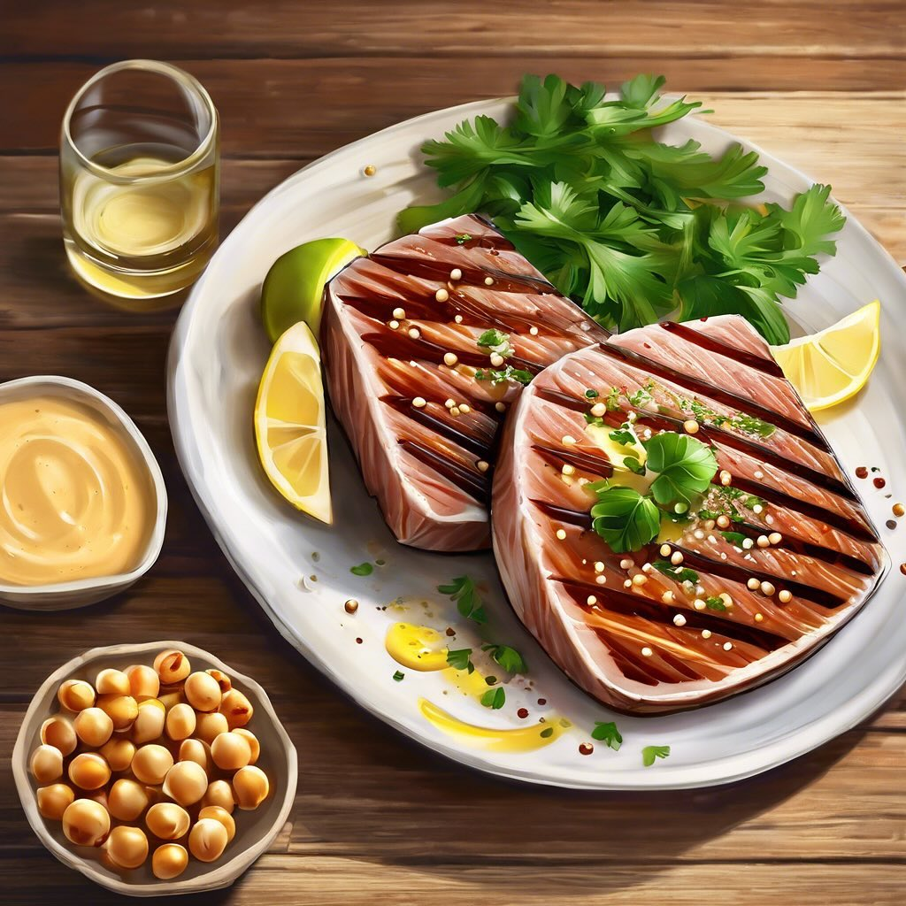

# ### Ingredienti: #### Per il filetto di tonno: - 2 filetti di tonno fresco (circ

### Ingredienti: #### Per il filetto di tonno: - 2 filetti di tonno fresco (circa 200-250 g ciascuno) - 2 cucchiai di olio d’oliva - Succo di 1 limone - 2 spicchi d’aglio, tritati - Sale e pepe q.b. - 1 cucchiaino di semi di sesamo (facoltativo) #### Per l’hummus di ceci: - 400 g di ceci in scatola, scolati e sciacquati - 2-3 cucchiai di tahini - Succo di 1 limone - 2 spicchi d’aglio, tritati - 3-4 cucchiai di olio d’oliva - Acqua q.b. (per raggiungere la consistenza desiderata) - Sale q.b. - Paprika dolce (per guarnire) ### Preparazione: #### Hummus di ceci: 1. **Frullare gli ingredienti**: In un frullatore, unisci i ceci, il tahini, il succo di limone, l’aglio e il sale. Inizia a frullare. 2. **Aggiungere l’olio e l’acqua**: Mentre frulli, aggiungi lentamente l’olio d’oliva e un po’ d’acqua fino a ottenere una consistenza cremosa e liscia. Se necessario, aggiungi più acqua. 3. **Regola di sale**: Assaggia e aggiusta di sale, se necessario. 4. **Guarnire**: Trasferisci l’hummus in una ciotola e spolvera con paprika dolce. #### Filetto di tonno alla griglia: 1. **Marinare il tonno**: In una ciotola, mescola l’olio d’oliva, il succo di limone, l’aglio tritato, il sale e il pepe. Aggiungi i filetti di tonno e lascia marinare per almeno 15-30 minuti. 2. **Preriscaldare la griglia**: Scalda la griglia a fuoco medio-alto. 3. **Grigliare il tonno**: Rimuovi i filetti dalla marinata e grigliali per circa 2-3 minuti per lato, a seconda dello spessore e della cottura desiderata. Se lo desideri, puoi cospargere i filetti con semi di sesamo durante la cottura. 4. **Servire**: Una volta cotti, togli i filetti di tonno dalla griglia e lasciali riposare un paio di minuti.

---

*Ricetta da @leguminando*
