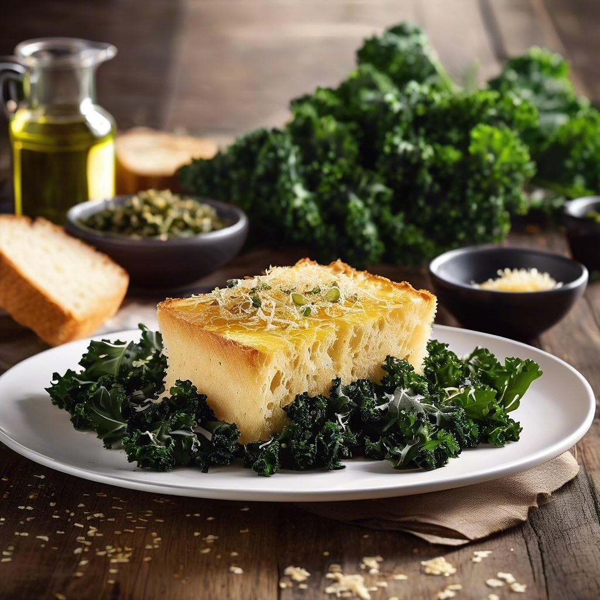

# # Ingredienti: #### Per il piatto principale: - 400 g di broccoli - 100 g di acc

# Ingredienti: #### Per il piatto principale: - 400 g di broccoli - 100 g di acciughe sott’olio - 100 g di olive nere denocciolate - 2 spicchi d’aglio - 3 cucchiai di olio d’oliva - Succo di 1 limone - Sale e pepe q.b. - Peperoncino (opzionale) #### Per l’hummus di ceci: - 400 g di ceci in scatola (sgocciolati e sciacquati) - 2 cucchiai di tahin (pasta di sesamo) - 2 cucchiai di olio d’oliva - Succo di 1 limone - 1 spicchio d’aglio - Sale q.b. - Acqua q.b. (per regolare la consistenza) ### Procedimento: #### Preparazione dell’hummus: 1. In un frullatore, unisci i ceci, il tahin, l’olio d’oliva, il succo di limone, l’aglio e il sale. 2. Frulla fino a ottenere una consistenza liscia. Se necessario, aggiungi un po’ d’acqua per rendere l’hummus più cremoso. 3. Assaggia e aggiusta di sale e limone, se necessario. Metti da parte. #### Preparazione dei broccoli: 1. Porta a ebollizione una pentola d’acqua salata e sbollenta i broccoli per circa 3-4 minuti, fino a quando sono teneri ma ancora croccanti. Scolali e mettili in acqua ghiacciata per fermare la cottura. 2. In una padella, scalda l’olio d’oliva e aggiungi l’aglio tritato. Fai soffriggere per un minuto. 3. Aggiungi i broccoli scolati e le acciughe. Cuoci per 3-4 minuti, mescolando frequentemente, fino a quando le acciughe si sciolgono e i broccoli sono ben conditi. 4. Aggiungi le olive e il succo di limone. Mescola bene e cuoci per un altro minuto. Aggiusta di sale e pepe, e aggiungi peperoncino se ti piace. ### Servizio: - Servi i broccoli con acciughe e olive su un piatto, accompagnati dall’hummus di ceci. Puoi usare dei crostini o verdure fresche per gustare l’hummus.

---

*Ricetta da @leguminando*
