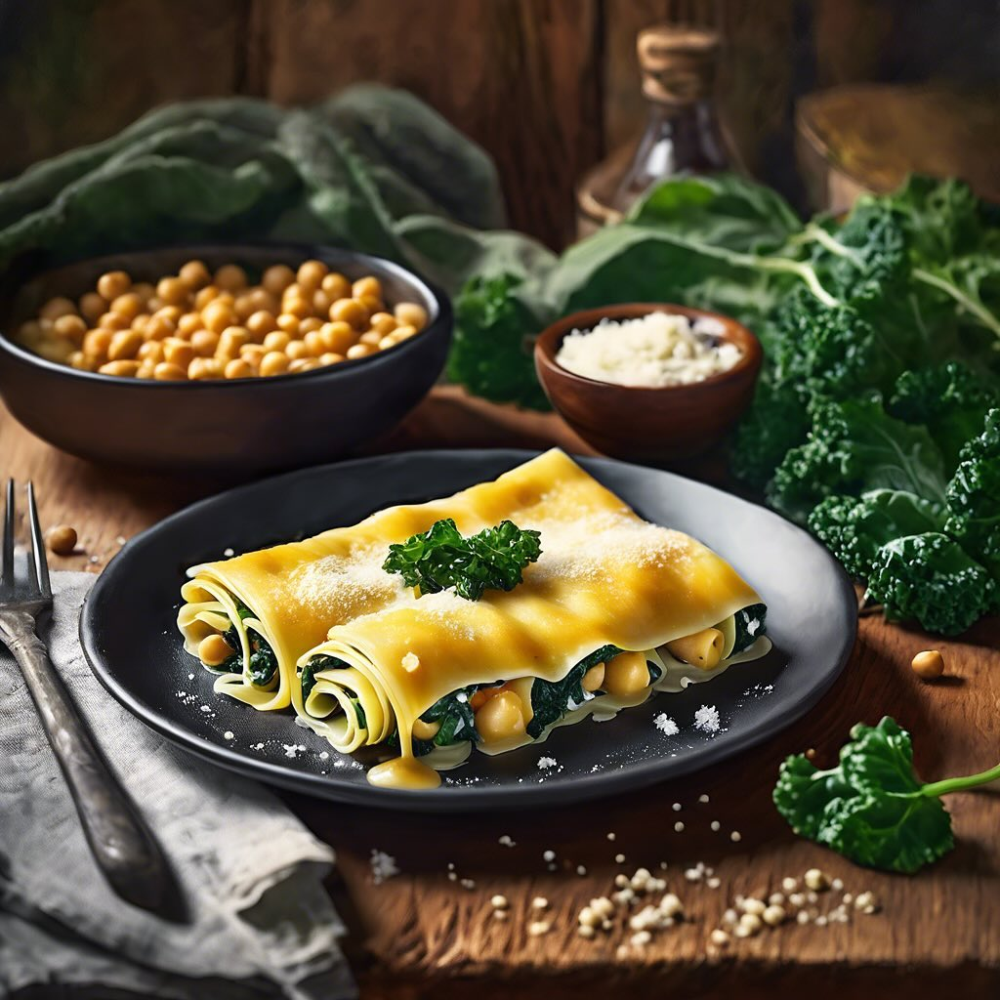

# ### Ingredienti: #### Per il radicchio e il finocchio: - 2 cespi di radicchio - 

### Ingredienti: #### Per il radicchio e il finocchio: - 2 cespi di radicchio - 2 finocchi - 50 g di parmigiano grattugiato - Olio extravergine d’oliva - Sale e pepe q.b. - Succo di limone (facoltativo) #### Per l’hummus di ceci: - 200 g di ceci (cotti, in scatola o lessati) - 2 cucchiai di tahina (pasta di sesamo) - 1 spicchio d’aglio - Succo di 1 limone - 3 cucchiai di olio extravergine d’oliva - Sale e pepe q.b. - Acqua q.b. (per raggiungere la consistenza desiderata) ### Procedimento: 1. **Preparare l’hummus**: In un frullatore, unisci i ceci, la tahina, l’aglio, il succo di limone e l’olio d’oliva. Frulla fino a ottenere una consistenza liscia. Se l’hummus risulta troppo denso, aggiungi un po’ d’acqua fino a raggiungere la consistenza desiderata. Aggiusta di sale e pepe. 2. **Preparare il finocchio**: Preriscalda il forno a 200°C. Lava e taglia i finocchi a spicchi. Disponili su una teglia rivestita di carta forno, condisci con olio, sale e pepe. Cuoci in forno per circa 25-30 minuti, fino a quando non sono teneri e leggermente dorati. 3. **Grigliare il radicchio**: Nel frattempo, taglia il radicchio a metà e spennellalo con un po’ d’olio d’oliva. Scalda una piastra o una griglia e griglia il radicchio per 3-4 minuti per lato, fino a quando non si formano delle belle striature e il radicchio appare appassito. 4. **Impiattare**: Su un piatto da portata, disponi il radicchio grigliato e gli spicchi di finocchio al forno. Spolverizza con parmigiano grattugiato e, se desideri, aggiungi un filo d’olio e qualche goccia di succo di limone. 5. **Servire**: Accompagna il piatto con l’hummus di ceci. Puoi servirlo come antipasto o come piatto principale leggero.

---

*Ricetta da @leguminando*
