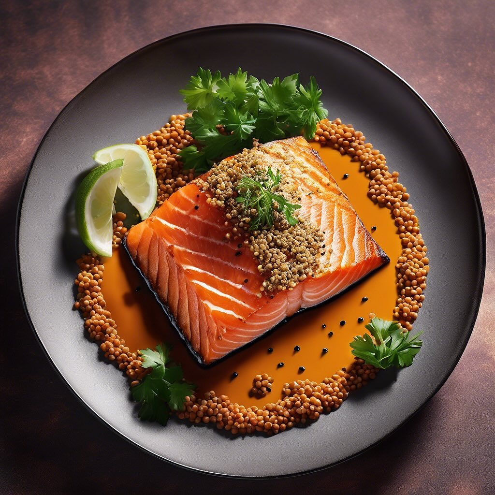

# ### Ingredienti #### Per il salmone impanato: - 4 filetti di salmone affumicato 

### Ingredienti #### Per il salmone impanato: - 4 filetti di salmone affumicato - 100 g di farina di lenticchie nere &#064;alcenerobiologico - 100 g di farina di lenticchie rosse - 2 uova - 100 g di pangrattato - Sale e pepe q.b. - Olio extravergine d’oliva per friggere #### Per l’hummus di ceci: - 400 g di ceci precotti (in scatola o cotti in casa) - 2 cucchiai di tahini - 1 spicchio d’aglio - Succo di 1 limone - 2 cucchiai di olio extravergine d’oliva &#064;slowfoodtoscana &#064;slowfood_costaetruschiaps &#064;slowfoodlivorno - Sale q.b. - Acqua q.b. (per ottenere la consistenza desiderata) - Paprika dolce e prezzemolo fresco per guarnire (opzionale) ### Preparazione #### Hummus di ceci: 1. Scolate e risciacquate i ceci. 2. In un frullatore, unite i ceci, il tahini, l’aglio, il succo di limone, l’olio d’oliva e un pizzico di sale. 3. Frullate fino a ottenere una crema liscia. Se necessario, aggiungete un po’ d’acqua per raggiungere la consistenza desiderata. 4. Assaggiate e regolate di sale o limone se necessario. 5. Trasferite l’hummus in una ciotola e guarnite con paprika dolce e prezzemolo fresco. #### Salmone impanato: 1. In tre piatti separati, preparate la farina di lenticchie nere, le uova sbattute e il pangrattato. 2. Condite la farina di lenticchie con sale e pepe. 3. Prendete un filetto di salmone e passatelo nella farina di lenticchie, quindi immergetelo nelle uova sbattute e infine nel pangrattato, premendo bene per farlo aderire. 4. Ripetete l’operazione per tutti i filetti di salmone. 5. In una padella, scaldate l’olio extravergine d’oliva e friggete i filetti di salmone impanati fino a doratura, circa 3-4 minuti per lato. 6. Scolate su carta assorbente per eliminare l’olio in eccesso. ### Servizio Servite i filetti di salmone impanati su un piatto con una generosa porzione di hummus di ceci a fianco. Potete accompagnare con fette di limone e una spruzzata di pepe nero per un tocco di freschezza.

---

*Ricetta da @leguminando*
