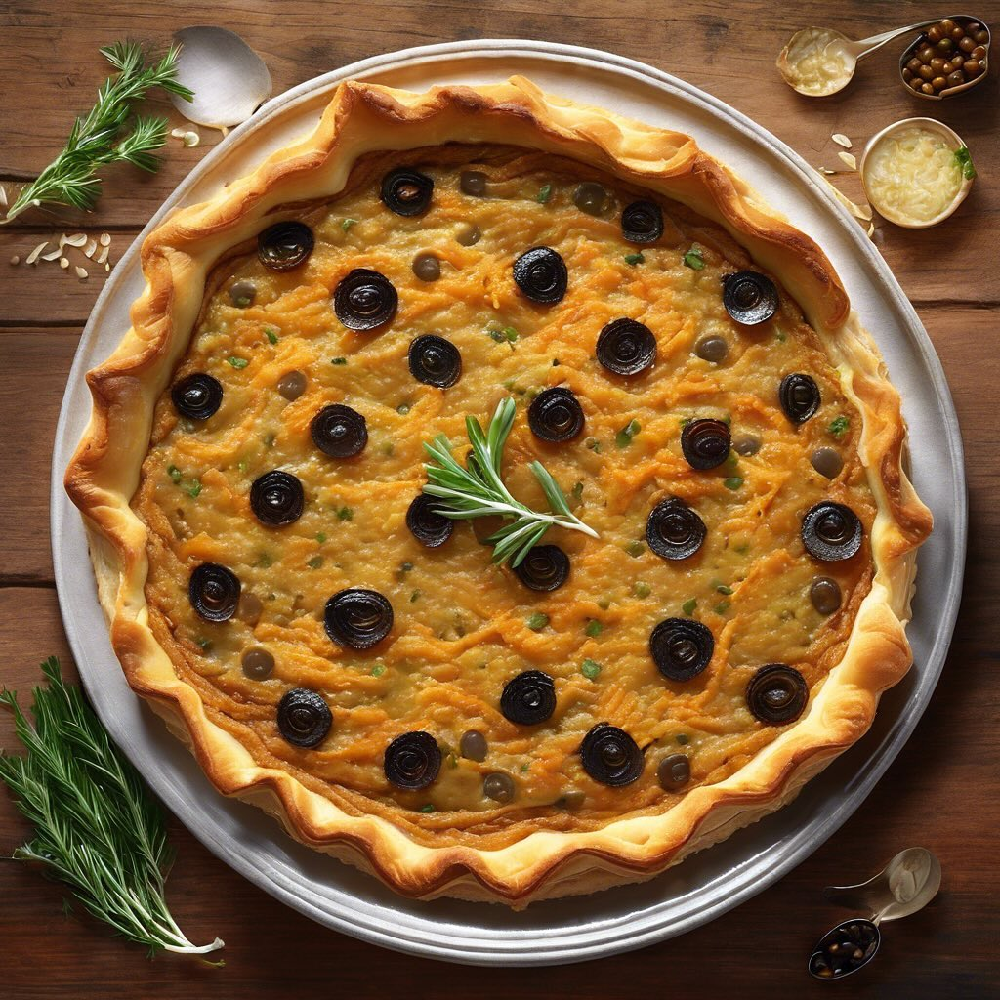

# ### Ingredienti #### Per la base della crostata - 200 g di farina di lenticchie 

### Ingredienti #### Per la base della crostata - 200 g di farina di lenticchie rosse - 100 g di burro (o olio d’oliva per una versione vegana) - 1 uovo (o un sostituto vegetale) - 50 ml di acqua fredda - 1 pizzico di sale #### Per il ripieno - 3 cipolle medie (preferibilmente cipolle di Tropea) - 100 g di acciughe sott’olio - 100 g di olive taggiasche (denocciolate) - 2 cucchiai di capperi (sciacquati) - 2 cucchiai di olio d’oliva - Sale e pepe q.b. - Origano o timo fresco (facoltativo) ### Procedimento #### Preparazione della base della crostata 1. **Impasto**: In una ciotola, mescola la farina di lenticchie rosse e il sale. Aggiungi il burro freddo a pezzetti e lavora l’impasto con le dita fino a ottenere un composto sabbioso. 2. **Uovo e acqua**: Aggiungi l’uovo e l’acqua fredda e impasta fino a ottenere una palla liscia. Se necessario, aggiungi un po’ più di acqua. Avvolgi l’impasto nella pellicola trasparente e mettilo in frigorifero per almeno 30 minuti. #### Preparazione del ripieno 3. **Cottura delle cipolle**: Affetta le cipolle sottilmente. In una padella, scalda l’olio d’oliva e aggiungi le cipolle. Cuoci a fuoco medio-basso, mescolando frequentemente, finché non diventano morbide e caramellate (circa 15-20 minuti). Aggiusta di sale e pepe. 4. **Aggiunta di acciughe, olive e capperi**: Quando le cipolle sono pronte, aggiungi le acciughe, le olive taggiasche e i capperi. Mescola bene e cuoci per altri 5 minuti, fino a quando le acciughe si sciolgono. #### Assemblaggio e cottura 5. **Stendere l’impasto**: Prendi l’impasto dal frigorifero e stendilo su una superficie infarinata (puoi usare un po’ di farina di lenticchie rosse) fino a ottenere uno spessore di circa 5 mm. Rivesti una tortiera con l’impasto, bucherellando il fondo con una forchetta. 6. **Versare il ripieno**: Versa il ripieno di cipolle, acciughe, olive e capperi nella base della crostata, distribuendolo uniformemente. 7. **Cottura**: Cuoci in forno preriscaldato a 180°C per circa 30-35 minuti, o fino a quando la crostata è dorata. #### Servizio Lascia raffreddare leggermente prima di servire. Puoi gustarla sia calda che a temperatura ambiente.

---

*Ricetta da @leguminando*
